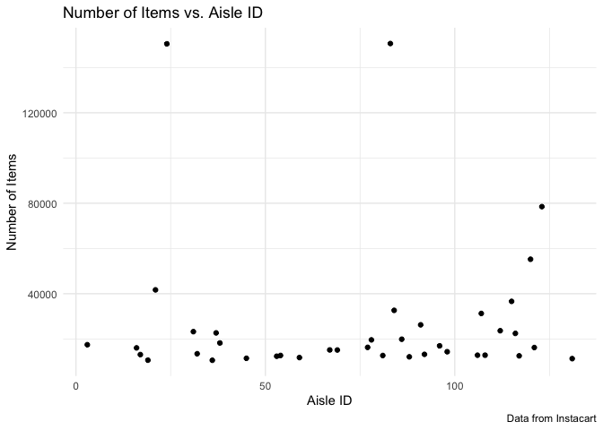
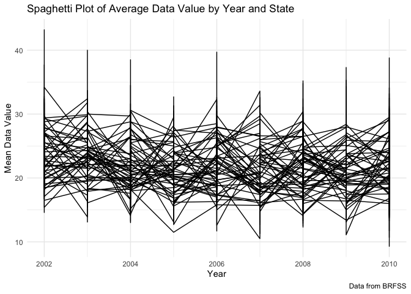
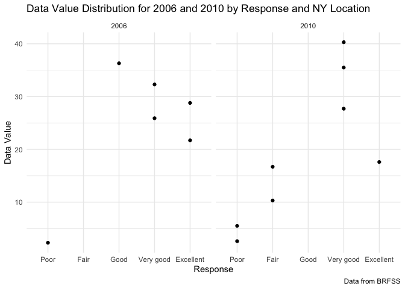

Homework3
================

\#Initialization

I will load the libraries and the dataset.

``` r
library(p8105.datasets)
library(tidyverse)
```

    ## ── Attaching packages ─────────────────────────────────────── tidyverse 1.3.1 ──

    ## ✓ ggplot2 3.3.5     ✓ purrr   0.3.4
    ## ✓ tibble  3.1.4     ✓ dplyr   1.0.7
    ## ✓ tidyr   1.1.3     ✓ stringr 1.4.0
    ## ✓ readr   2.0.1     ✓ forcats 0.5.1

    ## ── Conflicts ────────────────────────────────────────── tidyverse_conflicts() ──
    ## x dplyr::filter() masks stats::filter()
    ## x dplyr::lag()    masks stats::lag()

``` r
library(readxl)
library(haven)
data("instacart")
```

I will inspect the dataset.

``` r
df = instacart
df = janitor::clean_names(df)
str(df)
```

    ## tibble [1,384,617 × 15] (S3: tbl_df/tbl/data.frame)
    ##  $ order_id              : int [1:1384617] 1 1 1 1 1 1 1 1 36 36 ...
    ##  $ product_id            : int [1:1384617] 49302 11109 10246 49683 43633 13176 47209 22035 39612 19660 ...
    ##  $ add_to_cart_order     : int [1:1384617] 1 2 3 4 5 6 7 8 1 2 ...
    ##  $ reordered             : int [1:1384617] 1 1 0 0 1 0 0 1 0 1 ...
    ##  $ user_id               : int [1:1384617] 112108 112108 112108 112108 112108 112108 112108 112108 79431 79431 ...
    ##  $ eval_set              : chr [1:1384617] "train" "train" "train" "train" ...
    ##  $ order_number          : int [1:1384617] 4 4 4 4 4 4 4 4 23 23 ...
    ##  $ order_dow             : int [1:1384617] 4 4 4 4 4 4 4 4 6 6 ...
    ##  $ order_hour_of_day     : int [1:1384617] 10 10 10 10 10 10 10 10 18 18 ...
    ##  $ days_since_prior_order: int [1:1384617] 9 9 9 9 9 9 9 9 30 30 ...
    ##  $ product_name          : chr [1:1384617] "Bulgarian Yogurt" "Organic 4% Milk Fat Whole Milk Cottage Cheese" "Organic Celery Hearts" "Cucumber Kirby" ...
    ##  $ aisle_id              : int [1:1384617] 120 108 83 83 95 24 24 21 2 115 ...
    ##  $ department_id         : int [1:1384617] 16 16 4 4 15 4 4 16 16 7 ...
    ##  $ aisle                 : chr [1:1384617] "yogurt" "other creams cheeses" "fresh vegetables" "fresh vegetables" ...
    ##  $ department            : chr [1:1384617] "dairy eggs" "dairy eggs" "produce" "produce" ...
    ##  - attr(*, "spec")=
    ##   .. cols(
    ##   ..   order_id = col_integer(),
    ##   ..   product_id = col_integer(),
    ##   ..   add_to_cart_order = col_integer(),
    ##   ..   reordered = col_integer(),
    ##   ..   user_id = col_integer(),
    ##   ..   eval_set = col_character(),
    ##   ..   order_number = col_integer(),
    ##   ..   order_dow = col_integer(),
    ##   ..   order_hour_of_day = col_integer(),
    ##   ..   days_since_prior_order = col_integer(),
    ##   ..   product_name = col_character(),
    ##   ..   aisle_id = col_integer(),
    ##   ..   department_id = col_integer(),
    ##   ..   aisle = col_character(),
    ##   ..   department = col_character()
    ##   .. )

``` r
head(df)
```

    ## # A tibble: 6 × 15
    ##   order_id product_id add_to_cart_order reordered user_id eval_set order_number
    ##      <int>      <int>             <int>     <int>   <int> <chr>           <int>
    ## 1        1      49302                 1         1  112108 train               4
    ## 2        1      11109                 2         1  112108 train               4
    ## 3        1      10246                 3         0  112108 train               4
    ## 4        1      49683                 4         0  112108 train               4
    ## 5        1      43633                 5         1  112108 train               4
    ## 6        1      13176                 6         0  112108 train               4
    ## # … with 8 more variables: order_dow <int>, order_hour_of_day <int>,
    ## #   days_since_prior_order <int>, product_name <chr>, aisle_id <int>,
    ## #   department_id <int>, aisle <chr>, department <chr>

``` r
tail (df)
```

    ## # A tibble: 6 × 15
    ##   order_id product_id add_to_cart_order reordered user_id eval_set order_number
    ##      <int>      <int>             <int>     <int>   <int> <chr>           <int>
    ## 1  3421063      13565                 2         1  169679 train              30
    ## 2  3421063      14233                 3         1  169679 train              30
    ## 3  3421063      35548                 4         1  169679 train              30
    ## 4  3421070      35951                 1         1  139822 train              15
    ## 5  3421070      16953                 2         1  139822 train              15
    ## 6  3421070       4724                 3         1  139822 train              15
    ## # … with 8 more variables: order_dow <int>, order_hour_of_day <int>,
    ## #   days_since_prior_order <int>, product_name <chr>, aisle_id <int>,
    ## #   department_id <int>, aisle <chr>, department <chr>

There are 1384167 observations and 15 variables. Of those variables, 4
are characters. Some key variables are order identiifer, product
identifier, customer identifier, order day of the week, order hour,
aisle identiier and aisle name. From the header, we see one example of
an obseration is that the product “Bulgarian Yogurt” was in asile \#
120.

I will count the number of aislde IDs and their frequencies. I will sort
the frequencies in descending order.

``` r
df %>% group_by(aisle_id) %>% summarize(n_obs = n()) %>% arrange(desc(n_obs))
```

    ## # A tibble: 134 × 2
    ##    aisle_id  n_obs
    ##       <int>  <int>
    ##  1       83 150609
    ##  2       24 150473
    ##  3      123  78493
    ##  4      120  55240
    ##  5       21  41699
    ##  6      115  36617
    ##  7       84  32644
    ##  8      107  31269
    ##  9       91  26240
    ## 10      112  23635
    ## # … with 124 more rows

On the basis of this output, there are 134 aisle IDs. The aisle ids with
the highest frequencies are 83, 24, 123, 120, 21, 115, 84, 107, 91, 112.

I will make a data frame that filters to aisles with frequencies &gt;
10,000, and then plot frequencies (or number of items) vs. Aisle ID.

``` r
df_filter = df %>% group_by(aisle_id) %>% summarize(n_obs = n()) %>% filter(n_obs > 10000) %>% arrange(aisle_id)

ggplot(df_filter, aes(x = aisle_id, y = n_obs)) + geom_point() + 
  labs(
    title = "Number of Items vs. Aisle ID",
    x = "Aisle ID",
    y = "Number of Items",
    caption = "Data from Instacart"
  )  + theme_minimal()
```

<!-- -->

``` r
png('mes2165_homework3_problem1.png')
```

Now I will make the table of the most common items it the aisles named
“baking ingredients”, “dog food care” or “packaged vegetables fruits”. I
will filter on those aisles, group them, count them, and then filter to
the 3 most common items.

``` r
df_food = df %>% filter (aisle == "baking ingredients" | aisle ==  "dog food care" | aisle == "packaged vegetables fruits") %>% group_by(aisle) %>% count(product_id, product_name)

df_food_filter = df_food %>% filter(rank(desc(n))<= 3) %>% arrange(aisle, desc(n))
                    
df_food_filter
```

    ## # A tibble: 9 × 4
    ## # Groups:   aisle [3]
    ##   aisle                      product_id product_name                           n
    ##   <chr>                           <int> <chr>                              <int>
    ## 1 baking ingredients              23537 Light Brown Sugar                    499
    ## 2 baking ingredients              23405 Pure Baking Soda                     387
    ## 3 baking ingredients              49533 Cane Sugar                           336
    ## 4 dog food care                     722 Snack Sticks Chicken & Rice Recip…    30
    ## 5 dog food care                   23329 Organix Chicken & Brown Rice Reci…    28
    ## 6 dog food care                   17471 Small Dog Biscuits                    26
    ## 7 packaged vegetables fruits      21903 Organic Baby Spinach                9784
    ## 8 packaged vegetables fruits      27966 Organic Raspberries                 5546
    ## 9 packaged vegetables fruits      39275 Organic Blueberries                 4966

\#Problem 1 -fourth part.

Table of hour of the day when pink lady apples and coffee ice cream are
ordered.

``` r
mutate_df = df  %>% filter ((product_name == "Pink Lady Apples") | (product_name == "Coffee Ice Cream")) %>% group_by(product_name, order_dow) %>% summarize(mean_hour = mean(order_hour_of_day))
```

    ## `summarise()` has grouped output by 'product_name'. You can override using the `.groups` argument.

``` r
mutate_df %>%  pivot_wider(names_from = order_dow, values_from = mean_hour)
```

    ## # A tibble: 2 × 8
    ## # Groups:   product_name [2]
    ##   product_name       `0`   `1`   `2`   `3`   `4`   `5`   `6`
    ##   <chr>            <dbl> <dbl> <dbl> <dbl> <dbl> <dbl> <dbl>
    ## 1 Coffee Ice Cream  13.8  14.3  15.4  15.3  15.2  12.3  13.8
    ## 2 Pink Lady Apples  13.4  11.4  11.7  14.2  11.6  12.8  11.9

\#Problem 2 I will load the dataset for problem 2, and inspect the head
and sturcture of the data set.

``` r
library(p8105.datasets)
data("brfss_smart2010")
df_two = brfss_smart2010
df_two = janitor::clean_names(df_two)

head(df_two)
```

    ## # A tibble: 6 × 23
    ##    year locationabbr locationdesc  class  topic  question   response sample_size
    ##   <int> <chr>        <chr>         <chr>  <chr>  <chr>      <chr>          <int>
    ## 1  2010 AL           AL - Jeffers… Healt… Overa… How is yo… Excelle…          94
    ## 2  2010 AL           AL - Jeffers… Healt… Overa… How is yo… Very go…         148
    ## 3  2010 AL           AL - Jeffers… Healt… Overa… How is yo… Good             208
    ## 4  2010 AL           AL - Jeffers… Healt… Overa… How is yo… Fair             107
    ## 5  2010 AL           AL - Jeffers… Healt… Overa… How is yo… Poor              45
    ## 6  2010 AL           AL - Jeffers… Healt… Fair … Health St… Good or…         450
    ## # … with 15 more variables: data_value <dbl>, confidence_limit_low <dbl>,
    ## #   confidence_limit_high <dbl>, display_order <int>, data_value_unit <chr>,
    ## #   data_value_type <chr>, data_value_footnote_symbol <chr>,
    ## #   data_value_footnote <chr>, data_source <chr>, class_id <chr>,
    ## #   topic_id <chr>, location_id <chr>, question_id <chr>, respid <chr>,
    ## #   geo_location <chr>

``` r
str(df_two)
```

    ## tibble [134,203 × 23] (S3: tbl_df/tbl/data.frame)
    ##  $ year                      : int [1:134203] 2010 2010 2010 2010 2010 2010 2010 2010 2010 2010 ...
    ##  $ locationabbr              : chr [1:134203] "AL" "AL" "AL" "AL" ...
    ##  $ locationdesc              : chr [1:134203] "AL - Jefferson County" "AL - Jefferson County" "AL - Jefferson County" "AL - Jefferson County" ...
    ##  $ class                     : chr [1:134203] "Health Status" "Health Status" "Health Status" "Health Status" ...
    ##  $ topic                     : chr [1:134203] "Overall Health" "Overall Health" "Overall Health" "Overall Health" ...
    ##  $ question                  : chr [1:134203] "How is your general health?" "How is your general health?" "How is your general health?" "How is your general health?" ...
    ##  $ response                  : chr [1:134203] "Excellent" "Very good" "Good" "Fair" ...
    ##  $ sample_size               : int [1:134203] 94 148 208 107 45 450 152 524 77 316 ...
    ##  $ data_value                : num [1:134203] 18.9 30 33.1 12.5 5.5 82 18 79.3 20.7 74.9 ...
    ##  $ confidence_limit_low      : num [1:134203] 14.1 24.9 28.2 9.5 3.5 78.6 14.6 74 15.4 68.6 ...
    ##  $ confidence_limit_high     : num [1:134203] 23.6 35 38 15.4 7.4 85.3 21.3 84.5 25.9 81.1 ...
    ##  $ display_order             : int [1:134203] 1 2 3 4 5 6 7 8 9 10 ...
    ##  $ data_value_unit           : chr [1:134203] "%" "%" "%" "%" ...
    ##  $ data_value_type           : chr [1:134203] "Crude Prevalence" "Crude Prevalence" "Crude Prevalence" "Crude Prevalence" ...
    ##  $ data_value_footnote_symbol: chr [1:134203] NA NA NA NA ...
    ##  $ data_value_footnote       : chr [1:134203] NA NA NA NA ...
    ##  $ data_source               : chr [1:134203] "BRFSS" "BRFSS" "BRFSS" "BRFSS" ...
    ##  $ class_id                  : chr [1:134203] "CLASS08" "CLASS08" "CLASS08" "CLASS08" ...
    ##  $ topic_id                  : chr [1:134203] "Topic41" "Topic41" "Topic41" "Topic41" ...
    ##  $ location_id               : chr [1:134203] NA NA NA NA ...
    ##  $ question_id               : chr [1:134203] "GENHLTH" "GENHLTH" "GENHLTH" "GENHLTH" ...
    ##  $ respid                    : chr [1:134203] "RESP056" "RESP057" "RESP058" "RESP059" ...
    ##  $ geo_location              : chr [1:134203] "(33.518601, -86.814688)" "(33.518601, -86.814688)" "(33.518601, -86.814688)" "(33.518601, -86.814688)" ...
    ##  - attr(*, "spec")=
    ##   .. cols(
    ##   ..   Year = col_integer(),
    ##   ..   Locationabbr = col_character(),
    ##   ..   Locationdesc = col_character(),
    ##   ..   Class = col_character(),
    ##   ..   Topic = col_character(),
    ##   ..   Question = col_character(),
    ##   ..   Response = col_character(),
    ##   ..   Sample_Size = col_integer(),
    ##   ..   Data_value = col_double(),
    ##   ..   Confidence_limit_Low = col_double(),
    ##   ..   Confidence_limit_High = col_double(),
    ##   ..   Display_order = col_integer(),
    ##   ..   Data_value_unit = col_character(),
    ##   ..   Data_value_type = col_character(),
    ##   ..   Data_Value_Footnote_Symbol = col_character(),
    ##   ..   Data_Value_Footnote = col_character(),
    ##   ..   DataSource = col_character(),
    ##   ..   ClassId = col_character(),
    ##   ..   TopicId = col_character(),
    ##   ..   LocationID = col_character(),
    ##   ..   QuestionID = col_character(),
    ##   ..   RESPID = col_character(),
    ##   ..   GeoLocation = col_character()
    ##   .. )

I will filter on the “Overall Health” and change the class of the
response variable into factor, exclude entries that are not between poor
and excellent, and order the factors from 1 = poor to 5 = excellent.

``` r
df_two_filter = df_two %>% filter(topic == "Overall Health") %>% filter (response != c("Poor", "Fair", "Good", "Very good", "Excellent")) %>% mutate(response = factor(response, levels =c("Poor", "Fair", "Good", "Very good", "Excellent") )) 
head(df_two_filter)
```

    ## # A tibble: 6 × 23
    ##    year locationabbr locationdesc  class  topic  question   response sample_size
    ##   <int> <chr>        <chr>         <chr>  <chr>  <chr>      <fct>          <int>
    ## 1  2010 AL           AL - Jeffers… Healt… Overa… How is yo… Excelle…          94
    ## 2  2010 AL           AL - Jeffers… Healt… Overa… How is yo… Very go…         148
    ## 3  2010 AL           AL - Jeffers… Healt… Overa… How is yo… Fair             107
    ## 4  2010 AL           AL - Jeffers… Healt… Overa… How is yo… Poor              45
    ## 5  2010 AL           AL - Mobile … Healt… Overa… How is yo… Excelle…          91
    ## 6  2010 AL           AL - Mobile … Healt… Overa… How is yo… Very go…         177
    ## # … with 15 more variables: data_value <dbl>, confidence_limit_low <dbl>,
    ## #   confidence_limit_high <dbl>, display_order <int>, data_value_unit <chr>,
    ## #   data_value_type <chr>, data_value_footnote_symbol <chr>,
    ## #   data_value_footnote <chr>, data_source <chr>, class_id <chr>,
    ## #   topic_id <chr>, location_id <chr>, question_id <chr>, respid <chr>,
    ## #   geo_location <chr>

I will identify the states that were observed in 7 or more locations in
2002.

``` r
df_2002 = df_two_filter %>% filter (year == 2002) %>% group_by (locationabbr) %>% count() %>% filter(n>= 7) %>% arrange(desc(n))

df_2002_states = df_2002 %>% pull(locationabbr)
df_2002_states
```

    ##  [1] "PA" "MA" "NJ" "CT" "FL" "NC" "MD" "NH" "NY" "UT" "RI" "CO" "MI" "MN" "WA"
    ## [16] "OH" "HI" "VT" "DE" "GA" "IL" "LA" "NE" "OK" "OR" "SC" "KS" "AZ" "ID" "IN"
    ## [31] "ME" "MO" "NV" "SD" "TN" "TX"

The states that were observed in 7 or more locations in 2002 were: PA,
MA, NJ, CT, FL, NC, MD, NH, NY, UT, RI, CO, MI, MN, WA, OH, HI, VT, DE,
GA, IL, LA, NE, OK, OR, SC, KS, AZ, ID, IN, ME, MO, NV, SD, TN, TX.

I will repeat this process to identify the states that were observed in
7 or more locations in 2010.

``` r
df_2010 = df_two_filter %>% filter (year == 2010) %>% group_by (locationabbr) %>% count() %>% filter(n>= 7) %>% arrange(desc(n))

df_2010_states = df_2010 %>% pull(locationabbr)
df_2010_states
```

    ##  [1] "FL" "NJ" "TX" "MD" "CA" "NC" "NE" "WA" "MA" "NY" "OH" "SC" "CO" "PA" "VT"
    ## [16] "ID" "ME" "NM" "UT" "LA" "CT" "MN" "NH" "RI" "TN" "HI" "GA" "MI" "OR" "KS"
    ## [31] "AL" "AR" "AZ" "DE" "IN" "MO" "MT" "ND" "OK" "NV" "IA" "IL" "MS" "SD" "WY"

The states that were observed in 7 or more locations in 2002 were: FL,
NJ, TX, MD, CA, NC, NE, WA, MA, NY, OH, SC, CO, PA, VT, ID, ME, NM, UT,
LA, CT, MN, NH, RI, TN, HI, GA, MI, OR, KS, AL, AR, AZ, DE, IN, MO, MT,
ND, OK, NV, IA, IL, MS, SD, WY

I will make a data set that is limited to excellent responses and
contains, year, state, and a variable that averages the data\_value
across locations within a state.

``` r
df_two_excellent = df_two_filter %>% filter(response == "Excellent") %>% group_by (locationabbr, locationdesc, year) %>% summarize (mean_data_value = mean(data_value)) %>% rename(state = locationabbr) %>% rename(location = locationdesc)
```

    ## `summarise()` has grouped output by 'locationabbr', 'locationdesc'. You can override using the `.groups` argument.

``` r
view(df_two_excellent)
```

I will now make a spaghetti plot of of average data value over time
within a state.

``` r
ggplot(df_two_excellent, aes(x = year, y = mean_data_value, group = state)) + geom_line()+
  labs(
    title = "Spaghetti Plot of Average Data Value by Year and State",
    x = "Year",
    y = "Mean Data Value",
    caption = "Data from BRFSS"
  )  + theme_minimal()
```

<!-- -->

``` r
png('mes2165_homework3_problem2_spaghetti.png')
```

I will make a two-panel plot showing, for the years 2006, and 2010,
distribution of data\_value for responses (“Poor” to “Excellent”) among
locations in NY State.

First I will filter the data and rename some columns.

``` r
df_two_NY = df_two_filter %>% filter((year == 2006) | (year==2010)) %>% filter (response == c("Poor", "Fair", "Good", "Very good", "Excellent")) %>% filter (locationabbr == "NY") %>% rename(state = locationabbr) %>% rename(location = locationdesc)
```

    ## Warning in `==.default`(response, c("Poor", "Fair", "Good", "Very good", :
    ## longer object length is not a multiple of shorter object length

    ## Warning in is.na(e1) | is.na(e2): longer object length is not a multiple of
    ## shorter object length

``` r
head(df_two_NY)
```

    ## # A tibble: 6 × 23
    ##    year state location   class  topic  question  response sample_size data_value
    ##   <int> <chr> <chr>      <chr>  <chr>  <chr>     <fct>          <int>      <dbl>
    ## 1  2010 NY    NY - Bron… Healt… Overa… How is y… Excelle…          61       17.6
    ## 2  2010 NY    NY - Bron… Healt… Overa… How is y… Fair              86       16.7
    ## 3  2010 NY    NY - King… Healt… Overa… How is y… Very go…         246       27.7
    ## 4  2010 NY    NY - King… Healt… Overa… How is y… Poor              63        5.5
    ## 5  2010 NY    NY - New … Healt… Overa… How is y… Fair             127       10.3
    ## 6  2010 NY    NY - Suff… Healt… Overa… How is y… Very go…         192       35.5
    ## # … with 14 more variables: confidence_limit_low <dbl>,
    ## #   confidence_limit_high <dbl>, display_order <int>, data_value_unit <chr>,
    ## #   data_value_type <chr>, data_value_footnote_symbol <chr>,
    ## #   data_value_footnote <chr>, data_source <chr>, class_id <chr>,
    ## #   topic_id <chr>, location_id <chr>, question_id <chr>, respid <chr>,
    ## #   geo_location <chr>

``` r
tail(df_two_NY)
```

    ## # A tibble: 6 × 23
    ##    year state location   class  topic  question  response sample_size data_value
    ##   <int> <chr> <chr>      <chr>  <chr>  <chr>     <fct>          <int>      <dbl>
    ## 1  2006 NY    NY - King… Healt… Overa… How is y… Good             163       36.3
    ## 2  2006 NY    NY - Nass… Healt… Overa… How is y… Excelle…          81       21.7
    ## 3  2006 NY    NY - New … Healt… Overa… How is y… Very go…         161       32.3
    ## 4  2006 NY    NY - New … Healt… Overa… How is y… Excelle…         119       28.8
    ## 5  2006 NY    NY - Quee… Healt… Overa… How is y… Very go…         120       25.9
    ## 6  2006 NY    NY - Quee… Healt… Overa… How is y… Poor              16        2.3
    ## # … with 14 more variables: confidence_limit_low <dbl>,
    ## #   confidence_limit_high <dbl>, display_order <int>, data_value_unit <chr>,
    ## #   data_value_type <chr>, data_value_footnote_symbol <chr>,
    ## #   data_value_footnote <chr>, data_source <chr>, class_id <chr>,
    ## #   topic_id <chr>, location_id <chr>, question_id <chr>, respid <chr>,
    ## #   geo_location <chr>

Now, I will plot the data.

``` r
ggplot(df_two_NY, aes(x = response, y = data_value, group = location)) + geom_point() + facet_wrap(.~year) +
  labs(
    title = "Data Value Distribution for 2006 and 2010 by Response and NY Location",
    x = "Response",
    y = "Data Value",
    caption = "Data from BRFSS"
  )  + theme_minimal()
```

<!-- -->

``` r
png('mes2165_homework3_problem2_Data Value Distributions NY.png')
```

\#Problem 3 I will load and view the data set

``` r
df_accel = read_csv("accel_data.csv")
```

    ## Rows: 35 Columns: 1443

    ## ── Column specification ────────────────────────────────────────────────────────
    ## Delimiter: ","
    ## chr    (1): day
    ## dbl (1442): week, day_id, activity.1, activity.2, activity.3, activity.4, ac...

    ## 
    ## ℹ Use `spec()` to retrieve the full column specification for this data.
    ## ℹ Specify the column types or set `show_col_types = FALSE` to quiet this message.

``` r
df_accel = janitor::clean_names(df_accel)
head(df_accel)
```

    ## # A tibble: 6 × 1,443
    ##    week day_id day      activity_1 activity_2 activity_3 activity_4 activity_5
    ##   <dbl>  <dbl> <chr>         <dbl>      <dbl>      <dbl>      <dbl>      <dbl>
    ## 1     1      1 Friday         88.4       82.2       64.4       70.0       75.0
    ## 2     1      2 Monday          1          1          1          1          1  
    ## 3     1      3 Saturday        1          1          1          1          1  
    ## 4     1      4 Sunday          1          1          1          1          1  
    ## 5     1      5 Thursday       47.4       48.8       46.9       35.8       49.0
    ## 6     1      6 Tuesday        64.8       59.5       73.7       45.7       42.4
    ## # … with 1,435 more variables: activity_6 <dbl>, activity_7 <dbl>,
    ## #   activity_8 <dbl>, activity_9 <dbl>, activity_10 <dbl>, activity_11 <dbl>,
    ## #   activity_12 <dbl>, activity_13 <dbl>, activity_14 <dbl>, activity_15 <dbl>,
    ## #   activity_16 <dbl>, activity_17 <dbl>, activity_18 <dbl>, activity_19 <dbl>,
    ## #   activity_20 <dbl>, activity_21 <dbl>, activity_22 <dbl>, activity_23 <dbl>,
    ## #   activity_24 <dbl>, activity_25 <dbl>, activity_26 <dbl>, activity_27 <dbl>,
    ## #   activity_28 <dbl>, activity_29 <dbl>, activity_30 <dbl>, …

``` r
tail(df_accel)
```

    ## # A tibble: 6 × 1,443
    ##    week day_id day       activity_1 activity_2 activity_3 activity_4 activity_5
    ##   <dbl>  <dbl> <chr>          <dbl>      <dbl>      <dbl>      <dbl>      <dbl>
    ## 1     5     30 Monday             1          1          1         22          1
    ## 2     5     31 Saturday           1          1          1          1          1
    ## 3     5     32 Sunday             1          1          1          1          1
    ## 4     5     33 Thursday           1          1          1          1        106
    ## 5     5     34 Tuesday          200          1          1          1         22
    ## 6     5     35 Wednesday          1          1          1          1          1
    ## # … with 1,435 more variables: activity_6 <dbl>, activity_7 <dbl>,
    ## #   activity_8 <dbl>, activity_9 <dbl>, activity_10 <dbl>, activity_11 <dbl>,
    ## #   activity_12 <dbl>, activity_13 <dbl>, activity_14 <dbl>, activity_15 <dbl>,
    ## #   activity_16 <dbl>, activity_17 <dbl>, activity_18 <dbl>, activity_19 <dbl>,
    ## #   activity_20 <dbl>, activity_21 <dbl>, activity_22 <dbl>, activity_23 <dbl>,
    ## #   activity_24 <dbl>, activity_25 <dbl>, activity_26 <dbl>, activity_27 <dbl>,
    ## #   activity_28 <dbl>, activity_29 <dbl>, activity_30 <dbl>, …

``` r
str(df_accel)
```

    ## spec_tbl_df [35 × 1,443] (S3: spec_tbl_df/tbl_df/tbl/data.frame)
    ##  $ week         : num [1:35] 1 1 1 1 1 1 1 2 2 2 ...
    ##  $ day_id       : num [1:35] 1 2 3 4 5 6 7 8 9 10 ...
    ##  $ day          : chr [1:35] "Friday" "Monday" "Saturday" "Sunday" ...
    ##  $ activity_1   : num [1:35] 88.4 1 1 1 47.4 ...
    ##  $ activity_2   : num [1:35] 82.2 1 1 1 48.8 ...
    ##  $ activity_3   : num [1:35] 64.4 1 1 1 46.9 ...
    ##  $ activity_4   : num [1:35] 70 1 1 1 35.8 ...
    ##  $ activity_5   : num [1:35] 75 1 1 1 49 ...
    ##  $ activity_6   : num [1:35] 66.3 1 1 1 44.8 ...
    ##  $ activity_7   : num [1:35] 53.8 1 1 1 73.4 ...
    ##  $ activity_8   : num [1:35] 47.8 1 1 1 24.3 ...
    ##  $ activity_9   : num [1:35] 55.5 1 1 1 34.5 ...
    ##  $ activity_10  : num [1:35] 43 1 1 1 72.8 ...
    ##  $ activity_11  : num [1:35] 46.8 1 1 1 40.4 ...
    ##  $ activity_12  : num [1:35] 25.5 1 1 1 56.1 ...
    ##  $ activity_13  : num [1:35] 19 1 1 32 50 ...
    ##  $ activity_14  : num [1:35] 31.1 1 1 1 35.3 ...
    ##  $ activity_15  : num [1:35] 22.9 1 1 1 35.5 ...
    ##  $ activity_16  : num [1:35] 24.8 1 1 1 59.7 ...
    ##  $ activity_17  : num [1:35] 51 1 1 32 28.3 ...
    ##  $ activity_18  : num [1:35] 35.5 1 1 1 32 ...
    ##  $ activity_19  : num [1:35] 41 1 1 85 48.8 ...
    ##  $ activity_20  : num [1:35] 59 1 1 116 31.7 ...
    ##  $ activity_21  : num [1:35] 25.2 1 1 1 21 ...
    ##  $ activity_22  : num [1:35] 19.4 1 1 1 17.8 ...
    ##  $ activity_23  : num [1:35] 44.7 1 1 1 32.6 ...
    ##  $ activity_24  : num [1:35] 17.1 1 1 1 18.1 ...
    ##  $ activity_25  : num [1:35] 43.9 1 1 1 61.2 ...
    ##  $ activity_26  : num [1:35] 47.5 1 1 1 56.6 ...
    ##  $ activity_27  : num [1:35] 46.1 1 1 11 55.2 ...
    ##  $ activity_28  : num [1:35] 34.6 1 1 1 92.1 ...
    ##  $ activity_29  : num [1:35] 40.3 1 1 150 31.3 ...
    ##  $ activity_30  : num [1:35] 46.5 1 1 1 45.5 ...
    ##  $ activity_31  : num [1:35] 53.2 1 379 11 37.9 ...
    ##  $ activity_32  : num [1:35] 23.8 1 696 1 22.2 ...
    ##  $ activity_33  : num [1:35] 35.3 1 759 1 18.2 ...
    ##  $ activity_34  : num [1:35] 30.7 1 1168 64 26 ...
    ##  $ activity_35  : num [1:35] 40.1 1 150 276 19.5 ...
    ##  $ activity_36  : num [1:35] 25.3 1 53 1 8.2 ...
    ##  $ activity_37  : num [1:35] 8.89 1 95 1 16.6 ...
    ##  $ activity_38  : num [1:35] 14.7 1 150 1 18.1 ...
    ##  $ activity_39  : num [1:35] 18.5 1 32 1 39.6 ...
    ##  $ activity_40  : num [1:35] 40.7 1 74 1 21.2 ...
    ##  $ activity_41  : num [1:35] 20 1 137 1 30.4 ...
    ##  $ activity_42  : num [1:35] 37.1 1 305 1 38.3 ...
    ##  $ activity_43  : num [1:35] 22.6 1 305 1 53 ...
    ##  $ activity_44  : num [1:35] 22.8 1 43 1 37.2 ...
    ##  $ activity_45  : num [1:35] 16.1 1 85 163 45.8 ...
    ##  $ activity_46  : num [1:35] 29.8 1 64 1 22.4 ...
    ##  $ activity_47  : num [1:35] 39.4 1 1 1 20.6 ...
    ##  $ activity_48  : num [1:35] 29.7 1 1 1 37.3 ...
    ##  $ activity_49  : num [1:35] 54.8 1 1 95 42.3 ...
    ##  $ activity_50  : num [1:35] 48.3 1 1 1 44 ...
    ##  $ activity_51  : num [1:35] 66.1 1 1 1 41.8 ...
    ##  $ activity_52  : num [1:35] 65.2 1 1 1 58.3 ...
    ##  $ activity_53  : num [1:35] 35.7 1 1 1 63.8 ...
    ##  $ activity_54  : num [1:35] 31.7 1 1 1 31.7 ...
    ##  $ activity_55  : num [1:35] 26 1 1 1 24.6 ...
    ##  $ activity_56  : num [1:35] 36.6 1 1 1 29.1 ...
    ##  $ activity_57  : num [1:35] 25.2 1 1 1 19 ...
    ##  $ activity_58  : num [1:35] 27.9 1 1 1 54.6 ...
    ##  $ activity_59  : num [1:35] 58 1 1 1 35.9 ...
    ##  $ activity_60  : num [1:35] 44.2 1 1 1 34.1 ...
    ##  $ activity_61  : num [1:35] 46.8 1 1 1 40 ...
    ##  $ activity_62  : num [1:35] 41.7 1 1 1 25.2 ...
    ##  $ activity_63  : num [1:35] 57 1 1 1 35 ...
    ##  $ activity_64  : num [1:35] 51.2 1 1 1 41.6 ...
    ##  $ activity_65  : num [1:35] 63.5 1 1 1 23.9 ...
    ##  $ activity_66  : num [1:35] 45.4 1 11 1 19.3 ...
    ##  $ activity_67  : num [1:35] 44.89 1 1 1 8.64 ...
    ##  $ activity_68  : num [1:35] 21.7 1 11 1 12.9 ...
    ##  $ activity_69  : num [1:35] 11.6 1 1 1 11.7 ...
    ##  $ activity_70  : num [1:35] 37.4 1 1 1 15 ...
    ##  $ activity_71  : num [1:35] 36.1 1 1 1 22.7 ...
    ##  $ activity_72  : num [1:35] 25.8 1 1 1 50.5 ...
    ##  $ activity_73  : num [1:35] 15.1 1 1 1 19.6 ...
    ##  $ activity_74  : num [1:35] 38.5 1 1 1 18.5 ...
    ##  $ activity_75  : num [1:35] 46.7 1 1 1 34.1 ...
    ##  $ activity_76  : num [1:35] 50.1 1 1 11 27.3 ...
    ##  $ activity_77  : num [1:35] 52.5 1 1 43 33.8 ...
    ##  $ activity_78  : num [1:35] 67.9 1 1 1 10.3 ...
    ##  $ activity_79  : num [1:35] 71.4 1 1 1 11.2 ...
    ##  $ activity_80  : num [1:35] 61.1 1 1 1 8.2 ...
    ##  $ activity_81  : num [1:35] 35.4 1 1 74 27.6 ...
    ##  $ activity_82  : num [1:35] 41.5 1 1 1 10.6 ...
    ##  $ activity_83  : num [1:35] 46.6 1 1 74 28 ...
    ##  $ activity_84  : num [1:35] 38.3 1 1 85 30.7 ...
    ##  $ activity_85  : num [1:35] 23.4 1 1 1 57.1 ...
    ##  $ activity_86  : num [1:35] 68.7 1 1 1 29.9 ...
    ##  $ activity_87  : num [1:35] 44 1 1 1 41.9 ...
    ##  $ activity_88  : num [1:35] 33.82 1 1 1 7.71 ...
    ##  $ activity_89  : num [1:35] 21.3 1 1 1 19.4 ...
    ##  $ activity_90  : num [1:35] 37.1 1 1 1 19.2 ...
    ##  $ activity_91  : num [1:35] 46.8 1 1 1 7.8 ...
    ##  $ activity_92  : num [1:35] 46.87 1 1 1 4.71 ...
    ##  $ activity_93  : num [1:35] 39.78 1 1 1 7.27 ...
    ##  $ activity_94  : num [1:35] 26.8 1 1 1 15.3 ...
    ##  $ activity_95  : num [1:35] 22.7 1 1 1 25.9 ...
    ##  $ activity_96  : num [1:35] 36.3 1 1 1 41.7 ...
    ##   [list output truncated]
    ##  - attr(*, "spec")=
    ##   .. cols(
    ##   ..   week = col_double(),
    ##   ..   day_id = col_double(),
    ##   ..   day = col_character(),
    ##   ..   activity.1 = col_double(),
    ##   ..   activity.2 = col_double(),
    ##   ..   activity.3 = col_double(),
    ##   ..   activity.4 = col_double(),
    ##   ..   activity.5 = col_double(),
    ##   ..   activity.6 = col_double(),
    ##   ..   activity.7 = col_double(),
    ##   ..   activity.8 = col_double(),
    ##   ..   activity.9 = col_double(),
    ##   ..   activity.10 = col_double(),
    ##   ..   activity.11 = col_double(),
    ##   ..   activity.12 = col_double(),
    ##   ..   activity.13 = col_double(),
    ##   ..   activity.14 = col_double(),
    ##   ..   activity.15 = col_double(),
    ##   ..   activity.16 = col_double(),
    ##   ..   activity.17 = col_double(),
    ##   ..   activity.18 = col_double(),
    ##   ..   activity.19 = col_double(),
    ##   ..   activity.20 = col_double(),
    ##   ..   activity.21 = col_double(),
    ##   ..   activity.22 = col_double(),
    ##   ..   activity.23 = col_double(),
    ##   ..   activity.24 = col_double(),
    ##   ..   activity.25 = col_double(),
    ##   ..   activity.26 = col_double(),
    ##   ..   activity.27 = col_double(),
    ##   ..   activity.28 = col_double(),
    ##   ..   activity.29 = col_double(),
    ##   ..   activity.30 = col_double(),
    ##   ..   activity.31 = col_double(),
    ##   ..   activity.32 = col_double(),
    ##   ..   activity.33 = col_double(),
    ##   ..   activity.34 = col_double(),
    ##   ..   activity.35 = col_double(),
    ##   ..   activity.36 = col_double(),
    ##   ..   activity.37 = col_double(),
    ##   ..   activity.38 = col_double(),
    ##   ..   activity.39 = col_double(),
    ##   ..   activity.40 = col_double(),
    ##   ..   activity.41 = col_double(),
    ##   ..   activity.42 = col_double(),
    ##   ..   activity.43 = col_double(),
    ##   ..   activity.44 = col_double(),
    ##   ..   activity.45 = col_double(),
    ##   ..   activity.46 = col_double(),
    ##   ..   activity.47 = col_double(),
    ##   ..   activity.48 = col_double(),
    ##   ..   activity.49 = col_double(),
    ##   ..   activity.50 = col_double(),
    ##   ..   activity.51 = col_double(),
    ##   ..   activity.52 = col_double(),
    ##   ..   activity.53 = col_double(),
    ##   ..   activity.54 = col_double(),
    ##   ..   activity.55 = col_double(),
    ##   ..   activity.56 = col_double(),
    ##   ..   activity.57 = col_double(),
    ##   ..   activity.58 = col_double(),
    ##   ..   activity.59 = col_double(),
    ##   ..   activity.60 = col_double(),
    ##   ..   activity.61 = col_double(),
    ##   ..   activity.62 = col_double(),
    ##   ..   activity.63 = col_double(),
    ##   ..   activity.64 = col_double(),
    ##   ..   activity.65 = col_double(),
    ##   ..   activity.66 = col_double(),
    ##   ..   activity.67 = col_double(),
    ##   ..   activity.68 = col_double(),
    ##   ..   activity.69 = col_double(),
    ##   ..   activity.70 = col_double(),
    ##   ..   activity.71 = col_double(),
    ##   ..   activity.72 = col_double(),
    ##   ..   activity.73 = col_double(),
    ##   ..   activity.74 = col_double(),
    ##   ..   activity.75 = col_double(),
    ##   ..   activity.76 = col_double(),
    ##   ..   activity.77 = col_double(),
    ##   ..   activity.78 = col_double(),
    ##   ..   activity.79 = col_double(),
    ##   ..   activity.80 = col_double(),
    ##   ..   activity.81 = col_double(),
    ##   ..   activity.82 = col_double(),
    ##   ..   activity.83 = col_double(),
    ##   ..   activity.84 = col_double(),
    ##   ..   activity.85 = col_double(),
    ##   ..   activity.86 = col_double(),
    ##   ..   activity.87 = col_double(),
    ##   ..   activity.88 = col_double(),
    ##   ..   activity.89 = col_double(),
    ##   ..   activity.90 = col_double(),
    ##   ..   activity.91 = col_double(),
    ##   ..   activity.92 = col_double(),
    ##   ..   activity.93 = col_double(),
    ##   ..   activity.94 = col_double(),
    ##   ..   activity.95 = col_double(),
    ##   ..   activity.96 = col_double(),
    ##   ..   activity.97 = col_double(),
    ##   ..   activity.98 = col_double(),
    ##   ..   activity.99 = col_double(),
    ##   ..   activity.100 = col_double(),
    ##   ..   activity.101 = col_double(),
    ##   ..   activity.102 = col_double(),
    ##   ..   activity.103 = col_double(),
    ##   ..   activity.104 = col_double(),
    ##   ..   activity.105 = col_double(),
    ##   ..   activity.106 = col_double(),
    ##   ..   activity.107 = col_double(),
    ##   ..   activity.108 = col_double(),
    ##   ..   activity.109 = col_double(),
    ##   ..   activity.110 = col_double(),
    ##   ..   activity.111 = col_double(),
    ##   ..   activity.112 = col_double(),
    ##   ..   activity.113 = col_double(),
    ##   ..   activity.114 = col_double(),
    ##   ..   activity.115 = col_double(),
    ##   ..   activity.116 = col_double(),
    ##   ..   activity.117 = col_double(),
    ##   ..   activity.118 = col_double(),
    ##   ..   activity.119 = col_double(),
    ##   ..   activity.120 = col_double(),
    ##   ..   activity.121 = col_double(),
    ##   ..   activity.122 = col_double(),
    ##   ..   activity.123 = col_double(),
    ##   ..   activity.124 = col_double(),
    ##   ..   activity.125 = col_double(),
    ##   ..   activity.126 = col_double(),
    ##   ..   activity.127 = col_double(),
    ##   ..   activity.128 = col_double(),
    ##   ..   activity.129 = col_double(),
    ##   ..   activity.130 = col_double(),
    ##   ..   activity.131 = col_double(),
    ##   ..   activity.132 = col_double(),
    ##   ..   activity.133 = col_double(),
    ##   ..   activity.134 = col_double(),
    ##   ..   activity.135 = col_double(),
    ##   ..   activity.136 = col_double(),
    ##   ..   activity.137 = col_double(),
    ##   ..   activity.138 = col_double(),
    ##   ..   activity.139 = col_double(),
    ##   ..   activity.140 = col_double(),
    ##   ..   activity.141 = col_double(),
    ##   ..   activity.142 = col_double(),
    ##   ..   activity.143 = col_double(),
    ##   ..   activity.144 = col_double(),
    ##   ..   activity.145 = col_double(),
    ##   ..   activity.146 = col_double(),
    ##   ..   activity.147 = col_double(),
    ##   ..   activity.148 = col_double(),
    ##   ..   activity.149 = col_double(),
    ##   ..   activity.150 = col_double(),
    ##   ..   activity.151 = col_double(),
    ##   ..   activity.152 = col_double(),
    ##   ..   activity.153 = col_double(),
    ##   ..   activity.154 = col_double(),
    ##   ..   activity.155 = col_double(),
    ##   ..   activity.156 = col_double(),
    ##   ..   activity.157 = col_double(),
    ##   ..   activity.158 = col_double(),
    ##   ..   activity.159 = col_double(),
    ##   ..   activity.160 = col_double(),
    ##   ..   activity.161 = col_double(),
    ##   ..   activity.162 = col_double(),
    ##   ..   activity.163 = col_double(),
    ##   ..   activity.164 = col_double(),
    ##   ..   activity.165 = col_double(),
    ##   ..   activity.166 = col_double(),
    ##   ..   activity.167 = col_double(),
    ##   ..   activity.168 = col_double(),
    ##   ..   activity.169 = col_double(),
    ##   ..   activity.170 = col_double(),
    ##   ..   activity.171 = col_double(),
    ##   ..   activity.172 = col_double(),
    ##   ..   activity.173 = col_double(),
    ##   ..   activity.174 = col_double(),
    ##   ..   activity.175 = col_double(),
    ##   ..   activity.176 = col_double(),
    ##   ..   activity.177 = col_double(),
    ##   ..   activity.178 = col_double(),
    ##   ..   activity.179 = col_double(),
    ##   ..   activity.180 = col_double(),
    ##   ..   activity.181 = col_double(),
    ##   ..   activity.182 = col_double(),
    ##   ..   activity.183 = col_double(),
    ##   ..   activity.184 = col_double(),
    ##   ..   activity.185 = col_double(),
    ##   ..   activity.186 = col_double(),
    ##   ..   activity.187 = col_double(),
    ##   ..   activity.188 = col_double(),
    ##   ..   activity.189 = col_double(),
    ##   ..   activity.190 = col_double(),
    ##   ..   activity.191 = col_double(),
    ##   ..   activity.192 = col_double(),
    ##   ..   activity.193 = col_double(),
    ##   ..   activity.194 = col_double(),
    ##   ..   activity.195 = col_double(),
    ##   ..   activity.196 = col_double(),
    ##   ..   activity.197 = col_double(),
    ##   ..   activity.198 = col_double(),
    ##   ..   activity.199 = col_double(),
    ##   ..   activity.200 = col_double(),
    ##   ..   activity.201 = col_double(),
    ##   ..   activity.202 = col_double(),
    ##   ..   activity.203 = col_double(),
    ##   ..   activity.204 = col_double(),
    ##   ..   activity.205 = col_double(),
    ##   ..   activity.206 = col_double(),
    ##   ..   activity.207 = col_double(),
    ##   ..   activity.208 = col_double(),
    ##   ..   activity.209 = col_double(),
    ##   ..   activity.210 = col_double(),
    ##   ..   activity.211 = col_double(),
    ##   ..   activity.212 = col_double(),
    ##   ..   activity.213 = col_double(),
    ##   ..   activity.214 = col_double(),
    ##   ..   activity.215 = col_double(),
    ##   ..   activity.216 = col_double(),
    ##   ..   activity.217 = col_double(),
    ##   ..   activity.218 = col_double(),
    ##   ..   activity.219 = col_double(),
    ##   ..   activity.220 = col_double(),
    ##   ..   activity.221 = col_double(),
    ##   ..   activity.222 = col_double(),
    ##   ..   activity.223 = col_double(),
    ##   ..   activity.224 = col_double(),
    ##   ..   activity.225 = col_double(),
    ##   ..   activity.226 = col_double(),
    ##   ..   activity.227 = col_double(),
    ##   ..   activity.228 = col_double(),
    ##   ..   activity.229 = col_double(),
    ##   ..   activity.230 = col_double(),
    ##   ..   activity.231 = col_double(),
    ##   ..   activity.232 = col_double(),
    ##   ..   activity.233 = col_double(),
    ##   ..   activity.234 = col_double(),
    ##   ..   activity.235 = col_double(),
    ##   ..   activity.236 = col_double(),
    ##   ..   activity.237 = col_double(),
    ##   ..   activity.238 = col_double(),
    ##   ..   activity.239 = col_double(),
    ##   ..   activity.240 = col_double(),
    ##   ..   activity.241 = col_double(),
    ##   ..   activity.242 = col_double(),
    ##   ..   activity.243 = col_double(),
    ##   ..   activity.244 = col_double(),
    ##   ..   activity.245 = col_double(),
    ##   ..   activity.246 = col_double(),
    ##   ..   activity.247 = col_double(),
    ##   ..   activity.248 = col_double(),
    ##   ..   activity.249 = col_double(),
    ##   ..   activity.250 = col_double(),
    ##   ..   activity.251 = col_double(),
    ##   ..   activity.252 = col_double(),
    ##   ..   activity.253 = col_double(),
    ##   ..   activity.254 = col_double(),
    ##   ..   activity.255 = col_double(),
    ##   ..   activity.256 = col_double(),
    ##   ..   activity.257 = col_double(),
    ##   ..   activity.258 = col_double(),
    ##   ..   activity.259 = col_double(),
    ##   ..   activity.260 = col_double(),
    ##   ..   activity.261 = col_double(),
    ##   ..   activity.262 = col_double(),
    ##   ..   activity.263 = col_double(),
    ##   ..   activity.264 = col_double(),
    ##   ..   activity.265 = col_double(),
    ##   ..   activity.266 = col_double(),
    ##   ..   activity.267 = col_double(),
    ##   ..   activity.268 = col_double(),
    ##   ..   activity.269 = col_double(),
    ##   ..   activity.270 = col_double(),
    ##   ..   activity.271 = col_double(),
    ##   ..   activity.272 = col_double(),
    ##   ..   activity.273 = col_double(),
    ##   ..   activity.274 = col_double(),
    ##   ..   activity.275 = col_double(),
    ##   ..   activity.276 = col_double(),
    ##   ..   activity.277 = col_double(),
    ##   ..   activity.278 = col_double(),
    ##   ..   activity.279 = col_double(),
    ##   ..   activity.280 = col_double(),
    ##   ..   activity.281 = col_double(),
    ##   ..   activity.282 = col_double(),
    ##   ..   activity.283 = col_double(),
    ##   ..   activity.284 = col_double(),
    ##   ..   activity.285 = col_double(),
    ##   ..   activity.286 = col_double(),
    ##   ..   activity.287 = col_double(),
    ##   ..   activity.288 = col_double(),
    ##   ..   activity.289 = col_double(),
    ##   ..   activity.290 = col_double(),
    ##   ..   activity.291 = col_double(),
    ##   ..   activity.292 = col_double(),
    ##   ..   activity.293 = col_double(),
    ##   ..   activity.294 = col_double(),
    ##   ..   activity.295 = col_double(),
    ##   ..   activity.296 = col_double(),
    ##   ..   activity.297 = col_double(),
    ##   ..   activity.298 = col_double(),
    ##   ..   activity.299 = col_double(),
    ##   ..   activity.300 = col_double(),
    ##   ..   activity.301 = col_double(),
    ##   ..   activity.302 = col_double(),
    ##   ..   activity.303 = col_double(),
    ##   ..   activity.304 = col_double(),
    ##   ..   activity.305 = col_double(),
    ##   ..   activity.306 = col_double(),
    ##   ..   activity.307 = col_double(),
    ##   ..   activity.308 = col_double(),
    ##   ..   activity.309 = col_double(),
    ##   ..   activity.310 = col_double(),
    ##   ..   activity.311 = col_double(),
    ##   ..   activity.312 = col_double(),
    ##   ..   activity.313 = col_double(),
    ##   ..   activity.314 = col_double(),
    ##   ..   activity.315 = col_double(),
    ##   ..   activity.316 = col_double(),
    ##   ..   activity.317 = col_double(),
    ##   ..   activity.318 = col_double(),
    ##   ..   activity.319 = col_double(),
    ##   ..   activity.320 = col_double(),
    ##   ..   activity.321 = col_double(),
    ##   ..   activity.322 = col_double(),
    ##   ..   activity.323 = col_double(),
    ##   ..   activity.324 = col_double(),
    ##   ..   activity.325 = col_double(),
    ##   ..   activity.326 = col_double(),
    ##   ..   activity.327 = col_double(),
    ##   ..   activity.328 = col_double(),
    ##   ..   activity.329 = col_double(),
    ##   ..   activity.330 = col_double(),
    ##   ..   activity.331 = col_double(),
    ##   ..   activity.332 = col_double(),
    ##   ..   activity.333 = col_double(),
    ##   ..   activity.334 = col_double(),
    ##   ..   activity.335 = col_double(),
    ##   ..   activity.336 = col_double(),
    ##   ..   activity.337 = col_double(),
    ##   ..   activity.338 = col_double(),
    ##   ..   activity.339 = col_double(),
    ##   ..   activity.340 = col_double(),
    ##   ..   activity.341 = col_double(),
    ##   ..   activity.342 = col_double(),
    ##   ..   activity.343 = col_double(),
    ##   ..   activity.344 = col_double(),
    ##   ..   activity.345 = col_double(),
    ##   ..   activity.346 = col_double(),
    ##   ..   activity.347 = col_double(),
    ##   ..   activity.348 = col_double(),
    ##   ..   activity.349 = col_double(),
    ##   ..   activity.350 = col_double(),
    ##   ..   activity.351 = col_double(),
    ##   ..   activity.352 = col_double(),
    ##   ..   activity.353 = col_double(),
    ##   ..   activity.354 = col_double(),
    ##   ..   activity.355 = col_double(),
    ##   ..   activity.356 = col_double(),
    ##   ..   activity.357 = col_double(),
    ##   ..   activity.358 = col_double(),
    ##   ..   activity.359 = col_double(),
    ##   ..   activity.360 = col_double(),
    ##   ..   activity.361 = col_double(),
    ##   ..   activity.362 = col_double(),
    ##   ..   activity.363 = col_double(),
    ##   ..   activity.364 = col_double(),
    ##   ..   activity.365 = col_double(),
    ##   ..   activity.366 = col_double(),
    ##   ..   activity.367 = col_double(),
    ##   ..   activity.368 = col_double(),
    ##   ..   activity.369 = col_double(),
    ##   ..   activity.370 = col_double(),
    ##   ..   activity.371 = col_double(),
    ##   ..   activity.372 = col_double(),
    ##   ..   activity.373 = col_double(),
    ##   ..   activity.374 = col_double(),
    ##   ..   activity.375 = col_double(),
    ##   ..   activity.376 = col_double(),
    ##   ..   activity.377 = col_double(),
    ##   ..   activity.378 = col_double(),
    ##   ..   activity.379 = col_double(),
    ##   ..   activity.380 = col_double(),
    ##   ..   activity.381 = col_double(),
    ##   ..   activity.382 = col_double(),
    ##   ..   activity.383 = col_double(),
    ##   ..   activity.384 = col_double(),
    ##   ..   activity.385 = col_double(),
    ##   ..   activity.386 = col_double(),
    ##   ..   activity.387 = col_double(),
    ##   ..   activity.388 = col_double(),
    ##   ..   activity.389 = col_double(),
    ##   ..   activity.390 = col_double(),
    ##   ..   activity.391 = col_double(),
    ##   ..   activity.392 = col_double(),
    ##   ..   activity.393 = col_double(),
    ##   ..   activity.394 = col_double(),
    ##   ..   activity.395 = col_double(),
    ##   ..   activity.396 = col_double(),
    ##   ..   activity.397 = col_double(),
    ##   ..   activity.398 = col_double(),
    ##   ..   activity.399 = col_double(),
    ##   ..   activity.400 = col_double(),
    ##   ..   activity.401 = col_double(),
    ##   ..   activity.402 = col_double(),
    ##   ..   activity.403 = col_double(),
    ##   ..   activity.404 = col_double(),
    ##   ..   activity.405 = col_double(),
    ##   ..   activity.406 = col_double(),
    ##   ..   activity.407 = col_double(),
    ##   ..   activity.408 = col_double(),
    ##   ..   activity.409 = col_double(),
    ##   ..   activity.410 = col_double(),
    ##   ..   activity.411 = col_double(),
    ##   ..   activity.412 = col_double(),
    ##   ..   activity.413 = col_double(),
    ##   ..   activity.414 = col_double(),
    ##   ..   activity.415 = col_double(),
    ##   ..   activity.416 = col_double(),
    ##   ..   activity.417 = col_double(),
    ##   ..   activity.418 = col_double(),
    ##   ..   activity.419 = col_double(),
    ##   ..   activity.420 = col_double(),
    ##   ..   activity.421 = col_double(),
    ##   ..   activity.422 = col_double(),
    ##   ..   activity.423 = col_double(),
    ##   ..   activity.424 = col_double(),
    ##   ..   activity.425 = col_double(),
    ##   ..   activity.426 = col_double(),
    ##   ..   activity.427 = col_double(),
    ##   ..   activity.428 = col_double(),
    ##   ..   activity.429 = col_double(),
    ##   ..   activity.430 = col_double(),
    ##   ..   activity.431 = col_double(),
    ##   ..   activity.432 = col_double(),
    ##   ..   activity.433 = col_double(),
    ##   ..   activity.434 = col_double(),
    ##   ..   activity.435 = col_double(),
    ##   ..   activity.436 = col_double(),
    ##   ..   activity.437 = col_double(),
    ##   ..   activity.438 = col_double(),
    ##   ..   activity.439 = col_double(),
    ##   ..   activity.440 = col_double(),
    ##   ..   activity.441 = col_double(),
    ##   ..   activity.442 = col_double(),
    ##   ..   activity.443 = col_double(),
    ##   ..   activity.444 = col_double(),
    ##   ..   activity.445 = col_double(),
    ##   ..   activity.446 = col_double(),
    ##   ..   activity.447 = col_double(),
    ##   ..   activity.448 = col_double(),
    ##   ..   activity.449 = col_double(),
    ##   ..   activity.450 = col_double(),
    ##   ..   activity.451 = col_double(),
    ##   ..   activity.452 = col_double(),
    ##   ..   activity.453 = col_double(),
    ##   ..   activity.454 = col_double(),
    ##   ..   activity.455 = col_double(),
    ##   ..   activity.456 = col_double(),
    ##   ..   activity.457 = col_double(),
    ##   ..   activity.458 = col_double(),
    ##   ..   activity.459 = col_double(),
    ##   ..   activity.460 = col_double(),
    ##   ..   activity.461 = col_double(),
    ##   ..   activity.462 = col_double(),
    ##   ..   activity.463 = col_double(),
    ##   ..   activity.464 = col_double(),
    ##   ..   activity.465 = col_double(),
    ##   ..   activity.466 = col_double(),
    ##   ..   activity.467 = col_double(),
    ##   ..   activity.468 = col_double(),
    ##   ..   activity.469 = col_double(),
    ##   ..   activity.470 = col_double(),
    ##   ..   activity.471 = col_double(),
    ##   ..   activity.472 = col_double(),
    ##   ..   activity.473 = col_double(),
    ##   ..   activity.474 = col_double(),
    ##   ..   activity.475 = col_double(),
    ##   ..   activity.476 = col_double(),
    ##   ..   activity.477 = col_double(),
    ##   ..   activity.478 = col_double(),
    ##   ..   activity.479 = col_double(),
    ##   ..   activity.480 = col_double(),
    ##   ..   activity.481 = col_double(),
    ##   ..   activity.482 = col_double(),
    ##   ..   activity.483 = col_double(),
    ##   ..   activity.484 = col_double(),
    ##   ..   activity.485 = col_double(),
    ##   ..   activity.486 = col_double(),
    ##   ..   activity.487 = col_double(),
    ##   ..   activity.488 = col_double(),
    ##   ..   activity.489 = col_double(),
    ##   ..   activity.490 = col_double(),
    ##   ..   activity.491 = col_double(),
    ##   ..   activity.492 = col_double(),
    ##   ..   activity.493 = col_double(),
    ##   ..   activity.494 = col_double(),
    ##   ..   activity.495 = col_double(),
    ##   ..   activity.496 = col_double(),
    ##   ..   activity.497 = col_double(),
    ##   ..   activity.498 = col_double(),
    ##   ..   activity.499 = col_double(),
    ##   ..   activity.500 = col_double(),
    ##   ..   activity.501 = col_double(),
    ##   ..   activity.502 = col_double(),
    ##   ..   activity.503 = col_double(),
    ##   ..   activity.504 = col_double(),
    ##   ..   activity.505 = col_double(),
    ##   ..   activity.506 = col_double(),
    ##   ..   activity.507 = col_double(),
    ##   ..   activity.508 = col_double(),
    ##   ..   activity.509 = col_double(),
    ##   ..   activity.510 = col_double(),
    ##   ..   activity.511 = col_double(),
    ##   ..   activity.512 = col_double(),
    ##   ..   activity.513 = col_double(),
    ##   ..   activity.514 = col_double(),
    ##   ..   activity.515 = col_double(),
    ##   ..   activity.516 = col_double(),
    ##   ..   activity.517 = col_double(),
    ##   ..   activity.518 = col_double(),
    ##   ..   activity.519 = col_double(),
    ##   ..   activity.520 = col_double(),
    ##   ..   activity.521 = col_double(),
    ##   ..   activity.522 = col_double(),
    ##   ..   activity.523 = col_double(),
    ##   ..   activity.524 = col_double(),
    ##   ..   activity.525 = col_double(),
    ##   ..   activity.526 = col_double(),
    ##   ..   activity.527 = col_double(),
    ##   ..   activity.528 = col_double(),
    ##   ..   activity.529 = col_double(),
    ##   ..   activity.530 = col_double(),
    ##   ..   activity.531 = col_double(),
    ##   ..   activity.532 = col_double(),
    ##   ..   activity.533 = col_double(),
    ##   ..   activity.534 = col_double(),
    ##   ..   activity.535 = col_double(),
    ##   ..   activity.536 = col_double(),
    ##   ..   activity.537 = col_double(),
    ##   ..   activity.538 = col_double(),
    ##   ..   activity.539 = col_double(),
    ##   ..   activity.540 = col_double(),
    ##   ..   activity.541 = col_double(),
    ##   ..   activity.542 = col_double(),
    ##   ..   activity.543 = col_double(),
    ##   ..   activity.544 = col_double(),
    ##   ..   activity.545 = col_double(),
    ##   ..   activity.546 = col_double(),
    ##   ..   activity.547 = col_double(),
    ##   ..   activity.548 = col_double(),
    ##   ..   activity.549 = col_double(),
    ##   ..   activity.550 = col_double(),
    ##   ..   activity.551 = col_double(),
    ##   ..   activity.552 = col_double(),
    ##   ..   activity.553 = col_double(),
    ##   ..   activity.554 = col_double(),
    ##   ..   activity.555 = col_double(),
    ##   ..   activity.556 = col_double(),
    ##   ..   activity.557 = col_double(),
    ##   ..   activity.558 = col_double(),
    ##   ..   activity.559 = col_double(),
    ##   ..   activity.560 = col_double(),
    ##   ..   activity.561 = col_double(),
    ##   ..   activity.562 = col_double(),
    ##   ..   activity.563 = col_double(),
    ##   ..   activity.564 = col_double(),
    ##   ..   activity.565 = col_double(),
    ##   ..   activity.566 = col_double(),
    ##   ..   activity.567 = col_double(),
    ##   ..   activity.568 = col_double(),
    ##   ..   activity.569 = col_double(),
    ##   ..   activity.570 = col_double(),
    ##   ..   activity.571 = col_double(),
    ##   ..   activity.572 = col_double(),
    ##   ..   activity.573 = col_double(),
    ##   ..   activity.574 = col_double(),
    ##   ..   activity.575 = col_double(),
    ##   ..   activity.576 = col_double(),
    ##   ..   activity.577 = col_double(),
    ##   ..   activity.578 = col_double(),
    ##   ..   activity.579 = col_double(),
    ##   ..   activity.580 = col_double(),
    ##   ..   activity.581 = col_double(),
    ##   ..   activity.582 = col_double(),
    ##   ..   activity.583 = col_double(),
    ##   ..   activity.584 = col_double(),
    ##   ..   activity.585 = col_double(),
    ##   ..   activity.586 = col_double(),
    ##   ..   activity.587 = col_double(),
    ##   ..   activity.588 = col_double(),
    ##   ..   activity.589 = col_double(),
    ##   ..   activity.590 = col_double(),
    ##   ..   activity.591 = col_double(),
    ##   ..   activity.592 = col_double(),
    ##   ..   activity.593 = col_double(),
    ##   ..   activity.594 = col_double(),
    ##   ..   activity.595 = col_double(),
    ##   ..   activity.596 = col_double(),
    ##   ..   activity.597 = col_double(),
    ##   ..   activity.598 = col_double(),
    ##   ..   activity.599 = col_double(),
    ##   ..   activity.600 = col_double(),
    ##   ..   activity.601 = col_double(),
    ##   ..   activity.602 = col_double(),
    ##   ..   activity.603 = col_double(),
    ##   ..   activity.604 = col_double(),
    ##   ..   activity.605 = col_double(),
    ##   ..   activity.606 = col_double(),
    ##   ..   activity.607 = col_double(),
    ##   ..   activity.608 = col_double(),
    ##   ..   activity.609 = col_double(),
    ##   ..   activity.610 = col_double(),
    ##   ..   activity.611 = col_double(),
    ##   ..   activity.612 = col_double(),
    ##   ..   activity.613 = col_double(),
    ##   ..   activity.614 = col_double(),
    ##   ..   activity.615 = col_double(),
    ##   ..   activity.616 = col_double(),
    ##   ..   activity.617 = col_double(),
    ##   ..   activity.618 = col_double(),
    ##   ..   activity.619 = col_double(),
    ##   ..   activity.620 = col_double(),
    ##   ..   activity.621 = col_double(),
    ##   ..   activity.622 = col_double(),
    ##   ..   activity.623 = col_double(),
    ##   ..   activity.624 = col_double(),
    ##   ..   activity.625 = col_double(),
    ##   ..   activity.626 = col_double(),
    ##   ..   activity.627 = col_double(),
    ##   ..   activity.628 = col_double(),
    ##   ..   activity.629 = col_double(),
    ##   ..   activity.630 = col_double(),
    ##   ..   activity.631 = col_double(),
    ##   ..   activity.632 = col_double(),
    ##   ..   activity.633 = col_double(),
    ##   ..   activity.634 = col_double(),
    ##   ..   activity.635 = col_double(),
    ##   ..   activity.636 = col_double(),
    ##   ..   activity.637 = col_double(),
    ##   ..   activity.638 = col_double(),
    ##   ..   activity.639 = col_double(),
    ##   ..   activity.640 = col_double(),
    ##   ..   activity.641 = col_double(),
    ##   ..   activity.642 = col_double(),
    ##   ..   activity.643 = col_double(),
    ##   ..   activity.644 = col_double(),
    ##   ..   activity.645 = col_double(),
    ##   ..   activity.646 = col_double(),
    ##   ..   activity.647 = col_double(),
    ##   ..   activity.648 = col_double(),
    ##   ..   activity.649 = col_double(),
    ##   ..   activity.650 = col_double(),
    ##   ..   activity.651 = col_double(),
    ##   ..   activity.652 = col_double(),
    ##   ..   activity.653 = col_double(),
    ##   ..   activity.654 = col_double(),
    ##   ..   activity.655 = col_double(),
    ##   ..   activity.656 = col_double(),
    ##   ..   activity.657 = col_double(),
    ##   ..   activity.658 = col_double(),
    ##   ..   activity.659 = col_double(),
    ##   ..   activity.660 = col_double(),
    ##   ..   activity.661 = col_double(),
    ##   ..   activity.662 = col_double(),
    ##   ..   activity.663 = col_double(),
    ##   ..   activity.664 = col_double(),
    ##   ..   activity.665 = col_double(),
    ##   ..   activity.666 = col_double(),
    ##   ..   activity.667 = col_double(),
    ##   ..   activity.668 = col_double(),
    ##   ..   activity.669 = col_double(),
    ##   ..   activity.670 = col_double(),
    ##   ..   activity.671 = col_double(),
    ##   ..   activity.672 = col_double(),
    ##   ..   activity.673 = col_double(),
    ##   ..   activity.674 = col_double(),
    ##   ..   activity.675 = col_double(),
    ##   ..   activity.676 = col_double(),
    ##   ..   activity.677 = col_double(),
    ##   ..   activity.678 = col_double(),
    ##   ..   activity.679 = col_double(),
    ##   ..   activity.680 = col_double(),
    ##   ..   activity.681 = col_double(),
    ##   ..   activity.682 = col_double(),
    ##   ..   activity.683 = col_double(),
    ##   ..   activity.684 = col_double(),
    ##   ..   activity.685 = col_double(),
    ##   ..   activity.686 = col_double(),
    ##   ..   activity.687 = col_double(),
    ##   ..   activity.688 = col_double(),
    ##   ..   activity.689 = col_double(),
    ##   ..   activity.690 = col_double(),
    ##   ..   activity.691 = col_double(),
    ##   ..   activity.692 = col_double(),
    ##   ..   activity.693 = col_double(),
    ##   ..   activity.694 = col_double(),
    ##   ..   activity.695 = col_double(),
    ##   ..   activity.696 = col_double(),
    ##   ..   activity.697 = col_double(),
    ##   ..   activity.698 = col_double(),
    ##   ..   activity.699 = col_double(),
    ##   ..   activity.700 = col_double(),
    ##   ..   activity.701 = col_double(),
    ##   ..   activity.702 = col_double(),
    ##   ..   activity.703 = col_double(),
    ##   ..   activity.704 = col_double(),
    ##   ..   activity.705 = col_double(),
    ##   ..   activity.706 = col_double(),
    ##   ..   activity.707 = col_double(),
    ##   ..   activity.708 = col_double(),
    ##   ..   activity.709 = col_double(),
    ##   ..   activity.710 = col_double(),
    ##   ..   activity.711 = col_double(),
    ##   ..   activity.712 = col_double(),
    ##   ..   activity.713 = col_double(),
    ##   ..   activity.714 = col_double(),
    ##   ..   activity.715 = col_double(),
    ##   ..   activity.716 = col_double(),
    ##   ..   activity.717 = col_double(),
    ##   ..   activity.718 = col_double(),
    ##   ..   activity.719 = col_double(),
    ##   ..   activity.720 = col_double(),
    ##   ..   activity.721 = col_double(),
    ##   ..   activity.722 = col_double(),
    ##   ..   activity.723 = col_double(),
    ##   ..   activity.724 = col_double(),
    ##   ..   activity.725 = col_double(),
    ##   ..   activity.726 = col_double(),
    ##   ..   activity.727 = col_double(),
    ##   ..   activity.728 = col_double(),
    ##   ..   activity.729 = col_double(),
    ##   ..   activity.730 = col_double(),
    ##   ..   activity.731 = col_double(),
    ##   ..   activity.732 = col_double(),
    ##   ..   activity.733 = col_double(),
    ##   ..   activity.734 = col_double(),
    ##   ..   activity.735 = col_double(),
    ##   ..   activity.736 = col_double(),
    ##   ..   activity.737 = col_double(),
    ##   ..   activity.738 = col_double(),
    ##   ..   activity.739 = col_double(),
    ##   ..   activity.740 = col_double(),
    ##   ..   activity.741 = col_double(),
    ##   ..   activity.742 = col_double(),
    ##   ..   activity.743 = col_double(),
    ##   ..   activity.744 = col_double(),
    ##   ..   activity.745 = col_double(),
    ##   ..   activity.746 = col_double(),
    ##   ..   activity.747 = col_double(),
    ##   ..   activity.748 = col_double(),
    ##   ..   activity.749 = col_double(),
    ##   ..   activity.750 = col_double(),
    ##   ..   activity.751 = col_double(),
    ##   ..   activity.752 = col_double(),
    ##   ..   activity.753 = col_double(),
    ##   ..   activity.754 = col_double(),
    ##   ..   activity.755 = col_double(),
    ##   ..   activity.756 = col_double(),
    ##   ..   activity.757 = col_double(),
    ##   ..   activity.758 = col_double(),
    ##   ..   activity.759 = col_double(),
    ##   ..   activity.760 = col_double(),
    ##   ..   activity.761 = col_double(),
    ##   ..   activity.762 = col_double(),
    ##   ..   activity.763 = col_double(),
    ##   ..   activity.764 = col_double(),
    ##   ..   activity.765 = col_double(),
    ##   ..   activity.766 = col_double(),
    ##   ..   activity.767 = col_double(),
    ##   ..   activity.768 = col_double(),
    ##   ..   activity.769 = col_double(),
    ##   ..   activity.770 = col_double(),
    ##   ..   activity.771 = col_double(),
    ##   ..   activity.772 = col_double(),
    ##   ..   activity.773 = col_double(),
    ##   ..   activity.774 = col_double(),
    ##   ..   activity.775 = col_double(),
    ##   ..   activity.776 = col_double(),
    ##   ..   activity.777 = col_double(),
    ##   ..   activity.778 = col_double(),
    ##   ..   activity.779 = col_double(),
    ##   ..   activity.780 = col_double(),
    ##   ..   activity.781 = col_double(),
    ##   ..   activity.782 = col_double(),
    ##   ..   activity.783 = col_double(),
    ##   ..   activity.784 = col_double(),
    ##   ..   activity.785 = col_double(),
    ##   ..   activity.786 = col_double(),
    ##   ..   activity.787 = col_double(),
    ##   ..   activity.788 = col_double(),
    ##   ..   activity.789 = col_double(),
    ##   ..   activity.790 = col_double(),
    ##   ..   activity.791 = col_double(),
    ##   ..   activity.792 = col_double(),
    ##   ..   activity.793 = col_double(),
    ##   ..   activity.794 = col_double(),
    ##   ..   activity.795 = col_double(),
    ##   ..   activity.796 = col_double(),
    ##   ..   activity.797 = col_double(),
    ##   ..   activity.798 = col_double(),
    ##   ..   activity.799 = col_double(),
    ##   ..   activity.800 = col_double(),
    ##   ..   activity.801 = col_double(),
    ##   ..   activity.802 = col_double(),
    ##   ..   activity.803 = col_double(),
    ##   ..   activity.804 = col_double(),
    ##   ..   activity.805 = col_double(),
    ##   ..   activity.806 = col_double(),
    ##   ..   activity.807 = col_double(),
    ##   ..   activity.808 = col_double(),
    ##   ..   activity.809 = col_double(),
    ##   ..   activity.810 = col_double(),
    ##   ..   activity.811 = col_double(),
    ##   ..   activity.812 = col_double(),
    ##   ..   activity.813 = col_double(),
    ##   ..   activity.814 = col_double(),
    ##   ..   activity.815 = col_double(),
    ##   ..   activity.816 = col_double(),
    ##   ..   activity.817 = col_double(),
    ##   ..   activity.818 = col_double(),
    ##   ..   activity.819 = col_double(),
    ##   ..   activity.820 = col_double(),
    ##   ..   activity.821 = col_double(),
    ##   ..   activity.822 = col_double(),
    ##   ..   activity.823 = col_double(),
    ##   ..   activity.824 = col_double(),
    ##   ..   activity.825 = col_double(),
    ##   ..   activity.826 = col_double(),
    ##   ..   activity.827 = col_double(),
    ##   ..   activity.828 = col_double(),
    ##   ..   activity.829 = col_double(),
    ##   ..   activity.830 = col_double(),
    ##   ..   activity.831 = col_double(),
    ##   ..   activity.832 = col_double(),
    ##   ..   activity.833 = col_double(),
    ##   ..   activity.834 = col_double(),
    ##   ..   activity.835 = col_double(),
    ##   ..   activity.836 = col_double(),
    ##   ..   activity.837 = col_double(),
    ##   ..   activity.838 = col_double(),
    ##   ..   activity.839 = col_double(),
    ##   ..   activity.840 = col_double(),
    ##   ..   activity.841 = col_double(),
    ##   ..   activity.842 = col_double(),
    ##   ..   activity.843 = col_double(),
    ##   ..   activity.844 = col_double(),
    ##   ..   activity.845 = col_double(),
    ##   ..   activity.846 = col_double(),
    ##   ..   activity.847 = col_double(),
    ##   ..   activity.848 = col_double(),
    ##   ..   activity.849 = col_double(),
    ##   ..   activity.850 = col_double(),
    ##   ..   activity.851 = col_double(),
    ##   ..   activity.852 = col_double(),
    ##   ..   activity.853 = col_double(),
    ##   ..   activity.854 = col_double(),
    ##   ..   activity.855 = col_double(),
    ##   ..   activity.856 = col_double(),
    ##   ..   activity.857 = col_double(),
    ##   ..   activity.858 = col_double(),
    ##   ..   activity.859 = col_double(),
    ##   ..   activity.860 = col_double(),
    ##   ..   activity.861 = col_double(),
    ##   ..   activity.862 = col_double(),
    ##   ..   activity.863 = col_double(),
    ##   ..   activity.864 = col_double(),
    ##   ..   activity.865 = col_double(),
    ##   ..   activity.866 = col_double(),
    ##   ..   activity.867 = col_double(),
    ##   ..   activity.868 = col_double(),
    ##   ..   activity.869 = col_double(),
    ##   ..   activity.870 = col_double(),
    ##   ..   activity.871 = col_double(),
    ##   ..   activity.872 = col_double(),
    ##   ..   activity.873 = col_double(),
    ##   ..   activity.874 = col_double(),
    ##   ..   activity.875 = col_double(),
    ##   ..   activity.876 = col_double(),
    ##   ..   activity.877 = col_double(),
    ##   ..   activity.878 = col_double(),
    ##   ..   activity.879 = col_double(),
    ##   ..   activity.880 = col_double(),
    ##   ..   activity.881 = col_double(),
    ##   ..   activity.882 = col_double(),
    ##   ..   activity.883 = col_double(),
    ##   ..   activity.884 = col_double(),
    ##   ..   activity.885 = col_double(),
    ##   ..   activity.886 = col_double(),
    ##   ..   activity.887 = col_double(),
    ##   ..   activity.888 = col_double(),
    ##   ..   activity.889 = col_double(),
    ##   ..   activity.890 = col_double(),
    ##   ..   activity.891 = col_double(),
    ##   ..   activity.892 = col_double(),
    ##   ..   activity.893 = col_double(),
    ##   ..   activity.894 = col_double(),
    ##   ..   activity.895 = col_double(),
    ##   ..   activity.896 = col_double(),
    ##   ..   activity.897 = col_double(),
    ##   ..   activity.898 = col_double(),
    ##   ..   activity.899 = col_double(),
    ##   ..   activity.900 = col_double(),
    ##   ..   activity.901 = col_double(),
    ##   ..   activity.902 = col_double(),
    ##   ..   activity.903 = col_double(),
    ##   ..   activity.904 = col_double(),
    ##   ..   activity.905 = col_double(),
    ##   ..   activity.906 = col_double(),
    ##   ..   activity.907 = col_double(),
    ##   ..   activity.908 = col_double(),
    ##   ..   activity.909 = col_double(),
    ##   ..   activity.910 = col_double(),
    ##   ..   activity.911 = col_double(),
    ##   ..   activity.912 = col_double(),
    ##   ..   activity.913 = col_double(),
    ##   ..   activity.914 = col_double(),
    ##   ..   activity.915 = col_double(),
    ##   ..   activity.916 = col_double(),
    ##   ..   activity.917 = col_double(),
    ##   ..   activity.918 = col_double(),
    ##   ..   activity.919 = col_double(),
    ##   ..   activity.920 = col_double(),
    ##   ..   activity.921 = col_double(),
    ##   ..   activity.922 = col_double(),
    ##   ..   activity.923 = col_double(),
    ##   ..   activity.924 = col_double(),
    ##   ..   activity.925 = col_double(),
    ##   ..   activity.926 = col_double(),
    ##   ..   activity.927 = col_double(),
    ##   ..   activity.928 = col_double(),
    ##   ..   activity.929 = col_double(),
    ##   ..   activity.930 = col_double(),
    ##   ..   activity.931 = col_double(),
    ##   ..   activity.932 = col_double(),
    ##   ..   activity.933 = col_double(),
    ##   ..   activity.934 = col_double(),
    ##   ..   activity.935 = col_double(),
    ##   ..   activity.936 = col_double(),
    ##   ..   activity.937 = col_double(),
    ##   ..   activity.938 = col_double(),
    ##   ..   activity.939 = col_double(),
    ##   ..   activity.940 = col_double(),
    ##   ..   activity.941 = col_double(),
    ##   ..   activity.942 = col_double(),
    ##   ..   activity.943 = col_double(),
    ##   ..   activity.944 = col_double(),
    ##   ..   activity.945 = col_double(),
    ##   ..   activity.946 = col_double(),
    ##   ..   activity.947 = col_double(),
    ##   ..   activity.948 = col_double(),
    ##   ..   activity.949 = col_double(),
    ##   ..   activity.950 = col_double(),
    ##   ..   activity.951 = col_double(),
    ##   ..   activity.952 = col_double(),
    ##   ..   activity.953 = col_double(),
    ##   ..   activity.954 = col_double(),
    ##   ..   activity.955 = col_double(),
    ##   ..   activity.956 = col_double(),
    ##   ..   activity.957 = col_double(),
    ##   ..   activity.958 = col_double(),
    ##   ..   activity.959 = col_double(),
    ##   ..   activity.960 = col_double(),
    ##   ..   activity.961 = col_double(),
    ##   ..   activity.962 = col_double(),
    ##   ..   activity.963 = col_double(),
    ##   ..   activity.964 = col_double(),
    ##   ..   activity.965 = col_double(),
    ##   ..   activity.966 = col_double(),
    ##   ..   activity.967 = col_double(),
    ##   ..   activity.968 = col_double(),
    ##   ..   activity.969 = col_double(),
    ##   ..   activity.970 = col_double(),
    ##   ..   activity.971 = col_double(),
    ##   ..   activity.972 = col_double(),
    ##   ..   activity.973 = col_double(),
    ##   ..   activity.974 = col_double(),
    ##   ..   activity.975 = col_double(),
    ##   ..   activity.976 = col_double(),
    ##   ..   activity.977 = col_double(),
    ##   ..   activity.978 = col_double(),
    ##   ..   activity.979 = col_double(),
    ##   ..   activity.980 = col_double(),
    ##   ..   activity.981 = col_double(),
    ##   ..   activity.982 = col_double(),
    ##   ..   activity.983 = col_double(),
    ##   ..   activity.984 = col_double(),
    ##   ..   activity.985 = col_double(),
    ##   ..   activity.986 = col_double(),
    ##   ..   activity.987 = col_double(),
    ##   ..   activity.988 = col_double(),
    ##   ..   activity.989 = col_double(),
    ##   ..   activity.990 = col_double(),
    ##   ..   activity.991 = col_double(),
    ##   ..   activity.992 = col_double(),
    ##   ..   activity.993 = col_double(),
    ##   ..   activity.994 = col_double(),
    ##   ..   activity.995 = col_double(),
    ##   ..   activity.996 = col_double(),
    ##   ..   activity.997 = col_double(),
    ##   ..   activity.998 = col_double(),
    ##   ..   activity.999 = col_double(),
    ##   ..   activity.1000 = col_double(),
    ##   ..   activity.1001 = col_double(),
    ##   ..   activity.1002 = col_double(),
    ##   ..   activity.1003 = col_double(),
    ##   ..   activity.1004 = col_double(),
    ##   ..   activity.1005 = col_double(),
    ##   ..   activity.1006 = col_double(),
    ##   ..   activity.1007 = col_double(),
    ##   ..   activity.1008 = col_double(),
    ##   ..   activity.1009 = col_double(),
    ##   ..   activity.1010 = col_double(),
    ##   ..   activity.1011 = col_double(),
    ##   ..   activity.1012 = col_double(),
    ##   ..   activity.1013 = col_double(),
    ##   ..   activity.1014 = col_double(),
    ##   ..   activity.1015 = col_double(),
    ##   ..   activity.1016 = col_double(),
    ##   ..   activity.1017 = col_double(),
    ##   ..   activity.1018 = col_double(),
    ##   ..   activity.1019 = col_double(),
    ##   ..   activity.1020 = col_double(),
    ##   ..   activity.1021 = col_double(),
    ##   ..   activity.1022 = col_double(),
    ##   ..   activity.1023 = col_double(),
    ##   ..   activity.1024 = col_double(),
    ##   ..   activity.1025 = col_double(),
    ##   ..   activity.1026 = col_double(),
    ##   ..   activity.1027 = col_double(),
    ##   ..   activity.1028 = col_double(),
    ##   ..   activity.1029 = col_double(),
    ##   ..   activity.1030 = col_double(),
    ##   ..   activity.1031 = col_double(),
    ##   ..   activity.1032 = col_double(),
    ##   ..   activity.1033 = col_double(),
    ##   ..   activity.1034 = col_double(),
    ##   ..   activity.1035 = col_double(),
    ##   ..   activity.1036 = col_double(),
    ##   ..   activity.1037 = col_double(),
    ##   ..   activity.1038 = col_double(),
    ##   ..   activity.1039 = col_double(),
    ##   ..   activity.1040 = col_double(),
    ##   ..   activity.1041 = col_double(),
    ##   ..   activity.1042 = col_double(),
    ##   ..   activity.1043 = col_double(),
    ##   ..   activity.1044 = col_double(),
    ##   ..   activity.1045 = col_double(),
    ##   ..   activity.1046 = col_double(),
    ##   ..   activity.1047 = col_double(),
    ##   ..   activity.1048 = col_double(),
    ##   ..   activity.1049 = col_double(),
    ##   ..   activity.1050 = col_double(),
    ##   ..   activity.1051 = col_double(),
    ##   ..   activity.1052 = col_double(),
    ##   ..   activity.1053 = col_double(),
    ##   ..   activity.1054 = col_double(),
    ##   ..   activity.1055 = col_double(),
    ##   ..   activity.1056 = col_double(),
    ##   ..   activity.1057 = col_double(),
    ##   ..   activity.1058 = col_double(),
    ##   ..   activity.1059 = col_double(),
    ##   ..   activity.1060 = col_double(),
    ##   ..   activity.1061 = col_double(),
    ##   ..   activity.1062 = col_double(),
    ##   ..   activity.1063 = col_double(),
    ##   ..   activity.1064 = col_double(),
    ##   ..   activity.1065 = col_double(),
    ##   ..   activity.1066 = col_double(),
    ##   ..   activity.1067 = col_double(),
    ##   ..   activity.1068 = col_double(),
    ##   ..   activity.1069 = col_double(),
    ##   ..   activity.1070 = col_double(),
    ##   ..   activity.1071 = col_double(),
    ##   ..   activity.1072 = col_double(),
    ##   ..   activity.1073 = col_double(),
    ##   ..   activity.1074 = col_double(),
    ##   ..   activity.1075 = col_double(),
    ##   ..   activity.1076 = col_double(),
    ##   ..   activity.1077 = col_double(),
    ##   ..   activity.1078 = col_double(),
    ##   ..   activity.1079 = col_double(),
    ##   ..   activity.1080 = col_double(),
    ##   ..   activity.1081 = col_double(),
    ##   ..   activity.1082 = col_double(),
    ##   ..   activity.1083 = col_double(),
    ##   ..   activity.1084 = col_double(),
    ##   ..   activity.1085 = col_double(),
    ##   ..   activity.1086 = col_double(),
    ##   ..   activity.1087 = col_double(),
    ##   ..   activity.1088 = col_double(),
    ##   ..   activity.1089 = col_double(),
    ##   ..   activity.1090 = col_double(),
    ##   ..   activity.1091 = col_double(),
    ##   ..   activity.1092 = col_double(),
    ##   ..   activity.1093 = col_double(),
    ##   ..   activity.1094 = col_double(),
    ##   ..   activity.1095 = col_double(),
    ##   ..   activity.1096 = col_double(),
    ##   ..   activity.1097 = col_double(),
    ##   ..   activity.1098 = col_double(),
    ##   ..   activity.1099 = col_double(),
    ##   ..   activity.1100 = col_double(),
    ##   ..   activity.1101 = col_double(),
    ##   ..   activity.1102 = col_double(),
    ##   ..   activity.1103 = col_double(),
    ##   ..   activity.1104 = col_double(),
    ##   ..   activity.1105 = col_double(),
    ##   ..   activity.1106 = col_double(),
    ##   ..   activity.1107 = col_double(),
    ##   ..   activity.1108 = col_double(),
    ##   ..   activity.1109 = col_double(),
    ##   ..   activity.1110 = col_double(),
    ##   ..   activity.1111 = col_double(),
    ##   ..   activity.1112 = col_double(),
    ##   ..   activity.1113 = col_double(),
    ##   ..   activity.1114 = col_double(),
    ##   ..   activity.1115 = col_double(),
    ##   ..   activity.1116 = col_double(),
    ##   ..   activity.1117 = col_double(),
    ##   ..   activity.1118 = col_double(),
    ##   ..   activity.1119 = col_double(),
    ##   ..   activity.1120 = col_double(),
    ##   ..   activity.1121 = col_double(),
    ##   ..   activity.1122 = col_double(),
    ##   ..   activity.1123 = col_double(),
    ##   ..   activity.1124 = col_double(),
    ##   ..   activity.1125 = col_double(),
    ##   ..   activity.1126 = col_double(),
    ##   ..   activity.1127 = col_double(),
    ##   ..   activity.1128 = col_double(),
    ##   ..   activity.1129 = col_double(),
    ##   ..   activity.1130 = col_double(),
    ##   ..   activity.1131 = col_double(),
    ##   ..   activity.1132 = col_double(),
    ##   ..   activity.1133 = col_double(),
    ##   ..   activity.1134 = col_double(),
    ##   ..   activity.1135 = col_double(),
    ##   ..   activity.1136 = col_double(),
    ##   ..   activity.1137 = col_double(),
    ##   ..   activity.1138 = col_double(),
    ##   ..   activity.1139 = col_double(),
    ##   ..   activity.1140 = col_double(),
    ##   ..   activity.1141 = col_double(),
    ##   ..   activity.1142 = col_double(),
    ##   ..   activity.1143 = col_double(),
    ##   ..   activity.1144 = col_double(),
    ##   ..   activity.1145 = col_double(),
    ##   ..   activity.1146 = col_double(),
    ##   ..   activity.1147 = col_double(),
    ##   ..   activity.1148 = col_double(),
    ##   ..   activity.1149 = col_double(),
    ##   ..   activity.1150 = col_double(),
    ##   ..   activity.1151 = col_double(),
    ##   ..   activity.1152 = col_double(),
    ##   ..   activity.1153 = col_double(),
    ##   ..   activity.1154 = col_double(),
    ##   ..   activity.1155 = col_double(),
    ##   ..   activity.1156 = col_double(),
    ##   ..   activity.1157 = col_double(),
    ##   ..   activity.1158 = col_double(),
    ##   ..   activity.1159 = col_double(),
    ##   ..   activity.1160 = col_double(),
    ##   ..   activity.1161 = col_double(),
    ##   ..   activity.1162 = col_double(),
    ##   ..   activity.1163 = col_double(),
    ##   ..   activity.1164 = col_double(),
    ##   ..   activity.1165 = col_double(),
    ##   ..   activity.1166 = col_double(),
    ##   ..   activity.1167 = col_double(),
    ##   ..   activity.1168 = col_double(),
    ##   ..   activity.1169 = col_double(),
    ##   ..   activity.1170 = col_double(),
    ##   ..   activity.1171 = col_double(),
    ##   ..   activity.1172 = col_double(),
    ##   ..   activity.1173 = col_double(),
    ##   ..   activity.1174 = col_double(),
    ##   ..   activity.1175 = col_double(),
    ##   ..   activity.1176 = col_double(),
    ##   ..   activity.1177 = col_double(),
    ##   ..   activity.1178 = col_double(),
    ##   ..   activity.1179 = col_double(),
    ##   ..   activity.1180 = col_double(),
    ##   ..   activity.1181 = col_double(),
    ##   ..   activity.1182 = col_double(),
    ##   ..   activity.1183 = col_double(),
    ##   ..   activity.1184 = col_double(),
    ##   ..   activity.1185 = col_double(),
    ##   ..   activity.1186 = col_double(),
    ##   ..   activity.1187 = col_double(),
    ##   ..   activity.1188 = col_double(),
    ##   ..   activity.1189 = col_double(),
    ##   ..   activity.1190 = col_double(),
    ##   ..   activity.1191 = col_double(),
    ##   ..   activity.1192 = col_double(),
    ##   ..   activity.1193 = col_double(),
    ##   ..   activity.1194 = col_double(),
    ##   ..   activity.1195 = col_double(),
    ##   ..   activity.1196 = col_double(),
    ##   ..   activity.1197 = col_double(),
    ##   ..   activity.1198 = col_double(),
    ##   ..   activity.1199 = col_double(),
    ##   ..   activity.1200 = col_double(),
    ##   ..   activity.1201 = col_double(),
    ##   ..   activity.1202 = col_double(),
    ##   ..   activity.1203 = col_double(),
    ##   ..   activity.1204 = col_double(),
    ##   ..   activity.1205 = col_double(),
    ##   ..   activity.1206 = col_double(),
    ##   ..   activity.1207 = col_double(),
    ##   ..   activity.1208 = col_double(),
    ##   ..   activity.1209 = col_double(),
    ##   ..   activity.1210 = col_double(),
    ##   ..   activity.1211 = col_double(),
    ##   ..   activity.1212 = col_double(),
    ##   ..   activity.1213 = col_double(),
    ##   ..   activity.1214 = col_double(),
    ##   ..   activity.1215 = col_double(),
    ##   ..   activity.1216 = col_double(),
    ##   ..   activity.1217 = col_double(),
    ##   ..   activity.1218 = col_double(),
    ##   ..   activity.1219 = col_double(),
    ##   ..   activity.1220 = col_double(),
    ##   ..   activity.1221 = col_double(),
    ##   ..   activity.1222 = col_double(),
    ##   ..   activity.1223 = col_double(),
    ##   ..   activity.1224 = col_double(),
    ##   ..   activity.1225 = col_double(),
    ##   ..   activity.1226 = col_double(),
    ##   ..   activity.1227 = col_double(),
    ##   ..   activity.1228 = col_double(),
    ##   ..   activity.1229 = col_double(),
    ##   ..   activity.1230 = col_double(),
    ##   ..   activity.1231 = col_double(),
    ##   ..   activity.1232 = col_double(),
    ##   ..   activity.1233 = col_double(),
    ##   ..   activity.1234 = col_double(),
    ##   ..   activity.1235 = col_double(),
    ##   ..   activity.1236 = col_double(),
    ##   ..   activity.1237 = col_double(),
    ##   ..   activity.1238 = col_double(),
    ##   ..   activity.1239 = col_double(),
    ##   ..   activity.1240 = col_double(),
    ##   ..   activity.1241 = col_double(),
    ##   ..   activity.1242 = col_double(),
    ##   ..   activity.1243 = col_double(),
    ##   ..   activity.1244 = col_double(),
    ##   ..   activity.1245 = col_double(),
    ##   ..   activity.1246 = col_double(),
    ##   ..   activity.1247 = col_double(),
    ##   ..   activity.1248 = col_double(),
    ##   ..   activity.1249 = col_double(),
    ##   ..   activity.1250 = col_double(),
    ##   ..   activity.1251 = col_double(),
    ##   ..   activity.1252 = col_double(),
    ##   ..   activity.1253 = col_double(),
    ##   ..   activity.1254 = col_double(),
    ##   ..   activity.1255 = col_double(),
    ##   ..   activity.1256 = col_double(),
    ##   ..   activity.1257 = col_double(),
    ##   ..   activity.1258 = col_double(),
    ##   ..   activity.1259 = col_double(),
    ##   ..   activity.1260 = col_double(),
    ##   ..   activity.1261 = col_double(),
    ##   ..   activity.1262 = col_double(),
    ##   ..   activity.1263 = col_double(),
    ##   ..   activity.1264 = col_double(),
    ##   ..   activity.1265 = col_double(),
    ##   ..   activity.1266 = col_double(),
    ##   ..   activity.1267 = col_double(),
    ##   ..   activity.1268 = col_double(),
    ##   ..   activity.1269 = col_double(),
    ##   ..   activity.1270 = col_double(),
    ##   ..   activity.1271 = col_double(),
    ##   ..   activity.1272 = col_double(),
    ##   ..   activity.1273 = col_double(),
    ##   ..   activity.1274 = col_double(),
    ##   ..   activity.1275 = col_double(),
    ##   ..   activity.1276 = col_double(),
    ##   ..   activity.1277 = col_double(),
    ##   ..   activity.1278 = col_double(),
    ##   ..   activity.1279 = col_double(),
    ##   ..   activity.1280 = col_double(),
    ##   ..   activity.1281 = col_double(),
    ##   ..   activity.1282 = col_double(),
    ##   ..   activity.1283 = col_double(),
    ##   ..   activity.1284 = col_double(),
    ##   ..   activity.1285 = col_double(),
    ##   ..   activity.1286 = col_double(),
    ##   ..   activity.1287 = col_double(),
    ##   ..   activity.1288 = col_double(),
    ##   ..   activity.1289 = col_double(),
    ##   ..   activity.1290 = col_double(),
    ##   ..   activity.1291 = col_double(),
    ##   ..   activity.1292 = col_double(),
    ##   ..   activity.1293 = col_double(),
    ##   ..   activity.1294 = col_double(),
    ##   ..   activity.1295 = col_double(),
    ##   ..   activity.1296 = col_double(),
    ##   ..   activity.1297 = col_double(),
    ##   ..   activity.1298 = col_double(),
    ##   ..   activity.1299 = col_double(),
    ##   ..   activity.1300 = col_double(),
    ##   ..   activity.1301 = col_double(),
    ##   ..   activity.1302 = col_double(),
    ##   ..   activity.1303 = col_double(),
    ##   ..   activity.1304 = col_double(),
    ##   ..   activity.1305 = col_double(),
    ##   ..   activity.1306 = col_double(),
    ##   ..   activity.1307 = col_double(),
    ##   ..   activity.1308 = col_double(),
    ##   ..   activity.1309 = col_double(),
    ##   ..   activity.1310 = col_double(),
    ##   ..   activity.1311 = col_double(),
    ##   ..   activity.1312 = col_double(),
    ##   ..   activity.1313 = col_double(),
    ##   ..   activity.1314 = col_double(),
    ##   ..   activity.1315 = col_double(),
    ##   ..   activity.1316 = col_double(),
    ##   ..   activity.1317 = col_double(),
    ##   ..   activity.1318 = col_double(),
    ##   ..   activity.1319 = col_double(),
    ##   ..   activity.1320 = col_double(),
    ##   ..   activity.1321 = col_double(),
    ##   ..   activity.1322 = col_double(),
    ##   ..   activity.1323 = col_double(),
    ##   ..   activity.1324 = col_double(),
    ##   ..   activity.1325 = col_double(),
    ##   ..   activity.1326 = col_double(),
    ##   ..   activity.1327 = col_double(),
    ##   ..   activity.1328 = col_double(),
    ##   ..   activity.1329 = col_double(),
    ##   ..   activity.1330 = col_double(),
    ##   ..   activity.1331 = col_double(),
    ##   ..   activity.1332 = col_double(),
    ##   ..   activity.1333 = col_double(),
    ##   ..   activity.1334 = col_double(),
    ##   ..   activity.1335 = col_double(),
    ##   ..   activity.1336 = col_double(),
    ##   ..   activity.1337 = col_double(),
    ##   ..   activity.1338 = col_double(),
    ##   ..   activity.1339 = col_double(),
    ##   ..   activity.1340 = col_double(),
    ##   ..   activity.1341 = col_double(),
    ##   ..   activity.1342 = col_double(),
    ##   ..   activity.1343 = col_double(),
    ##   ..   activity.1344 = col_double(),
    ##   ..   activity.1345 = col_double(),
    ##   ..   activity.1346 = col_double(),
    ##   ..   activity.1347 = col_double(),
    ##   ..   activity.1348 = col_double(),
    ##   ..   activity.1349 = col_double(),
    ##   ..   activity.1350 = col_double(),
    ##   ..   activity.1351 = col_double(),
    ##   ..   activity.1352 = col_double(),
    ##   ..   activity.1353 = col_double(),
    ##   ..   activity.1354 = col_double(),
    ##   ..   activity.1355 = col_double(),
    ##   ..   activity.1356 = col_double(),
    ##   ..   activity.1357 = col_double(),
    ##   ..   activity.1358 = col_double(),
    ##   ..   activity.1359 = col_double(),
    ##   ..   activity.1360 = col_double(),
    ##   ..   activity.1361 = col_double(),
    ##   ..   activity.1362 = col_double(),
    ##   ..   activity.1363 = col_double(),
    ##   ..   activity.1364 = col_double(),
    ##   ..   activity.1365 = col_double(),
    ##   ..   activity.1366 = col_double(),
    ##   ..   activity.1367 = col_double(),
    ##   ..   activity.1368 = col_double(),
    ##   ..   activity.1369 = col_double(),
    ##   ..   activity.1370 = col_double(),
    ##   ..   activity.1371 = col_double(),
    ##   ..   activity.1372 = col_double(),
    ##   ..   activity.1373 = col_double(),
    ##   ..   activity.1374 = col_double(),
    ##   ..   activity.1375 = col_double(),
    ##   ..   activity.1376 = col_double(),
    ##   ..   activity.1377 = col_double(),
    ##   ..   activity.1378 = col_double(),
    ##   ..   activity.1379 = col_double(),
    ##   ..   activity.1380 = col_double(),
    ##   ..   activity.1381 = col_double(),
    ##   ..   activity.1382 = col_double(),
    ##   ..   activity.1383 = col_double(),
    ##   ..   activity.1384 = col_double(),
    ##   ..   activity.1385 = col_double(),
    ##   ..   activity.1386 = col_double(),
    ##   ..   activity.1387 = col_double(),
    ##   ..   activity.1388 = col_double(),
    ##   ..   activity.1389 = col_double(),
    ##   ..   activity.1390 = col_double(),
    ##   ..   activity.1391 = col_double(),
    ##   ..   activity.1392 = col_double(),
    ##   ..   activity.1393 = col_double(),
    ##   ..   activity.1394 = col_double(),
    ##   ..   activity.1395 = col_double(),
    ##   ..   activity.1396 = col_double(),
    ##   ..   activity.1397 = col_double(),
    ##   ..   activity.1398 = col_double(),
    ##   ..   activity.1399 = col_double(),
    ##   ..   activity.1400 = col_double(),
    ##   ..   activity.1401 = col_double(),
    ##   ..   activity.1402 = col_double(),
    ##   ..   activity.1403 = col_double(),
    ##   ..   activity.1404 = col_double(),
    ##   ..   activity.1405 = col_double(),
    ##   ..   activity.1406 = col_double(),
    ##   ..   activity.1407 = col_double(),
    ##   ..   activity.1408 = col_double(),
    ##   ..   activity.1409 = col_double(),
    ##   ..   activity.1410 = col_double(),
    ##   ..   activity.1411 = col_double(),
    ##   ..   activity.1412 = col_double(),
    ##   ..   activity.1413 = col_double(),
    ##   ..   activity.1414 = col_double(),
    ##   ..   activity.1415 = col_double(),
    ##   ..   activity.1416 = col_double(),
    ##   ..   activity.1417 = col_double(),
    ##   ..   activity.1418 = col_double(),
    ##   ..   activity.1419 = col_double(),
    ##   ..   activity.1420 = col_double(),
    ##   ..   activity.1421 = col_double(),
    ##   ..   activity.1422 = col_double(),
    ##   ..   activity.1423 = col_double(),
    ##   ..   activity.1424 = col_double(),
    ##   ..   activity.1425 = col_double(),
    ##   ..   activity.1426 = col_double(),
    ##   ..   activity.1427 = col_double(),
    ##   ..   activity.1428 = col_double(),
    ##   ..   activity.1429 = col_double(),
    ##   ..   activity.1430 = col_double(),
    ##   ..   activity.1431 = col_double(),
    ##   ..   activity.1432 = col_double(),
    ##   ..   activity.1433 = col_double(),
    ##   ..   activity.1434 = col_double(),
    ##   ..   activity.1435 = col_double(),
    ##   ..   activity.1436 = col_double(),
    ##   ..   activity.1437 = col_double(),
    ##   ..   activity.1438 = col_double(),
    ##   ..   activity.1439 = col_double(),
    ##   ..   activity.1440 = col_double()
    ##   .. )
    ##  - attr(*, "problems")=<externalptr>

``` r
view(df_accel)
```

I will make a weekend or weekday and weekend variables. First, I will
convert the days to a factor variable.

``` r
df_accel_edit = df_accel %>% mutate(weekday = (day %in% c("Monday", "Tuesday", "Wednesday", "Thursday", "Friday"))) %>% pull(weekday)
```
